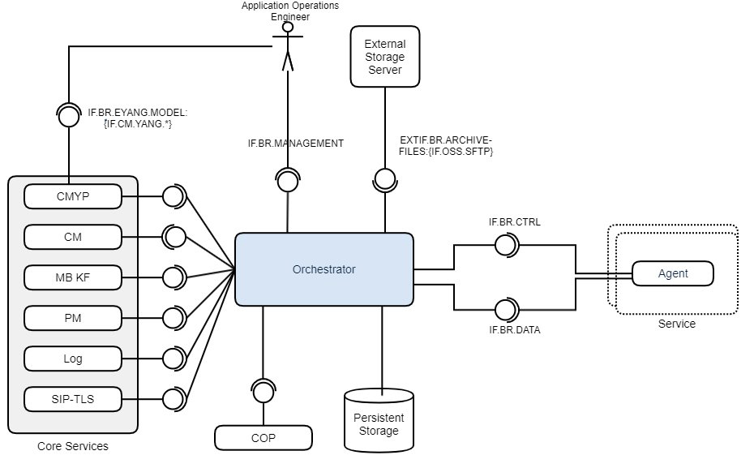

<!--Document Template information:
Prepared:Oliver Browne
Approved:***
Document Name:Backup and Restore User Guide
Revision: {!../../../.bob/var.rstate!}
Date: {!../../../.bob/var.IMAGE_CREATED!}
-->

# Backup and Restore Orchestrator User Guide

[TOC]

## Overview

This section provides an overview of the Backup and Restore Orchestrator Service. It gives a brief description of its main features and its interfaces.

For an overview of end to end architecture, see the [end to end Backup and Restore guide](https://gerrit-gamma.gic.ericsson.se/plugins/gitiles/AIA/adp-doc-backup-and-restore/+/refs/heads/master/backup_and_restore.md#Deployments).

The primary goal of the Backup and Restore Orchestrator service is to provide a consistent set of API's for backup and restore operations orchestration across multiple services. This is achieved via communication between the Backup and Restore Orchestrator component and one or more application-specific Agents.

### Main Concepts
The major concepts related to the Backup and Restore Orchestrator are:

#### Backup
Set of data for a service, stored remotely. It represents the state those services had at the time it was created, and can be used to recreate that state.

#### Restore
Copy data from a backup to recreate the state the affected services had at the time when the backup was created.

#### Agent
Part of a service that is used to integrate that service into the ADP backup and restore solution. It communicates with the BR Orchestrator, and has logic specific to the service it is bundled with to create and restore backups.

#### Fragment
A piece of the backup that is uploaded by an Agent to the Orchestrator during a backup operation or downloaded from the Orchestrator during a restore operation. Each backup consists of one or more backup fragments per agent.

#### Backup Type
Each agent can register as belonging to zero or more backup types. A backup type defines a set of agents, this allows for a backup to be taken of a subset of services.

### Supported Use Cases
 Use Case ID | Use Case Title | Compliance | Maturity
---|---|---|---
 UC.BR.BACKUP | Create an application backup file | Fully Supported | Stable
 UC.BR.RESTORE | Restore an application backup file | Fully Supported | Stable
 UC.BR.IMPORT | Import an application backup file | Fully Supported | Stable
 UC.BR.EXPORT | Export an application backup file | Fully Supported | Stable
 UC.BR.DELETE | Delete an application backup file | Fully Supported | Stable
 UC.BR.NOTIFICATION | Notify that a backup and restore operation has started, completed or failed. | Fully Supported | Stable

#### Configuration
BRO exposes configurations features that can be set during runtime.

 Feature | Configuration purpose
 --- | ---
 Housekeeping | Setting a limit to the number of retained backups and if backups should be removed automatically upon reaching this limit.
 Scheduling | Setting a periodic schedule for the automatic execution of the backup and export operations.


### Architecture
The following diagram shows the Backup and Restore Orchestrator Service and its
architectural context.



Figure 1 Architecture view of the Backup and Restore Orchestrator Service

Interface Logical Name | Interface Realization | Description | Interface Maturity
---|---|---|---
IF.BR.MANAGEMENT | [REST Specification][RestSpecification] | Interface used to invoke, query and configure backup and restore operations over REST | Stable
IF.BR.EYANG.MODEL {IF.CM.YANG.\*} | [BRO with CMYP Guide][BROCYMPOperationsGuide] | Interface used to invoke/query backup and restore actions via CM/YP | Stable
IF.BR.CTRL | [GRPC Specification][GRPCSpecification] | Interface used for control and coordination messages / events between the BR Orchestrator and Agents | Stable
IF.BR.DATA | [GRPC Specification][GRPCSpecification] | Interface used for two-way data transfer between the BR Orchestrator and Agents during the Backup and Restore use cases | Stable
EXTIF.BR.ARCHIVE-FILES:{IF.OSS.SFTP} | SFTP | Interface used to transport backups into and out of BRO's external storage | Stable

### Application Programming Interfaces (APIs)
This chapter gives an overview of included APIs and their maturity. 

API | API Version | API Slogan   | API Maturity
--- |-------------|--------------|---
CAF101026 | v4 | BRO GRPC API | Stable
1/CAF101027 | v1/v3 | BRO REST API | Stable
2/CAF101027 | v4 | BRO REST API | Stable

#### Expected KPI-behavior for each API and LCM-activity are listed in the table below.
BRO is a Singleton service.

API | Use Case  | KPI | Behavior for this KPI
--- |-----------|---|---
BRO REST API | Upgrade   | Service Down Time | 45s
BRO REST API | Upgrade   | Traffic Latency Increase (%) | 0%
BRO REST API | Upgrade   | Traffic Loss (%) | 100 percent traffic loss
BRO REST API | Downgrade | Service Down Time | 44s
BRO REST API | Downgrade | Traffic Latency Increase (%) | 0%
BRO REST API | Downgrade | Traffic Loss (%) | 100 percent traffic loss
BRO REST API | Scale In  | Service Down Time | N/A
BRO REST API | Scale In  | Traffic Latency Increase (%) | N/A
BRO REST API | Scale In  | Traffic Loss (%) | N/A
BRO REST API | Scale Out | Service Down Time | N/A
BRO REST API | Scale Out | Traffic Latency Increase (%) | N/A
BRO REST API | Scale Out | Traffic Loss (%) | N/A
BRO GRPC API | Upgrade   | Service Down Time | 45s
BRO GRPC API | Upgrade   | Traffic Latency Increase (%) | 0%
BRO GRPC API | Upgrade   | Traffic Loss (%) | 100 percent traffic loss
BRO GRPC API | Downgrade  | Service Down Time | 44s
BRO GRPC API | Downgrade  | Traffic Latency Increase (%) | 0%
BRO GRPC API | Downgrade  | Traffic Loss (%) | 100 percent traffic loss
BRO GRPC API | Scale In  | Service Down Time | N/A
BRO GRPC API | Scale In  | Traffic Latency Increase (%) | N/A
BRO GRPC API | Scale In  | Traffic Loss (%) | N/A
BRO GRPC API | Scale Out | Service Down Time | N/A
BRO GRPC API | Scale Out | Traffic Latency Increase (%) | N/A
BRO GRPC API | Scale Out | Traffic Loss (%) | N/A


### Optional Features
The Backup and Restore Orchestrator has a number of optional features.

#### Agent Discovery

The Orchestrator will use the Kubernetes API to find all Agents expected to participate in a backup. If the registered Agents do not match the expected agents, the backup will fail.

#### Message Bus Notification
The Orchestrator pushes a notification message to a Message Bus service (either Message Bus KF or Key Value Database RD) every time a backup or a restore has started, completed or failed, indicating the status of the action.

When connecting to operator based Message Bus KF service the following values should be set:

* global.messageBusKF.operator.enabled
* messageBusKF.enabled
* messageBusKF.clusterName

A Kafka notification message example is:

`{ "version": "1.0.0", "action": "RESTORE", "actionId":"7643", "backupManagerId":"DEFAULT", "status": "STARTED"}`

Redis notification messages are key-value pairs. By default, the value of the notification message is in plain text format. For example:

`{'notification': 'Notification [version=1.0.0, action=RESTORE, actionId=7643, backupManagerId=DEFAULT, status=STARTED]'}`

However, the value of the notification message can also be configured to be in JSON format by setting the value of the `keyValueDatabaseRd.notificationValueFormat` or `keyValueDatabaseRD.notificationValueFormat` parameter to "ASAJSONSTRING". When this option is enabled, the value of the notification message will be a JSON string, for example:

`{'notification': '{"version":"1.0.0","action":"RESTORE","actionId":"7643","backupManagerId":"DEFAULT","status":"STARTED"}'}`


Field | Description | Value
---|---|---
 `version` | Indicates the version of the BR_INTERNAL_NOTIFICATION API that the notification adheres to | <BR_INTERNAL_NOTIFICATION_VERSION>
 `action` | Indicates the action which published the notification | `CREATE_BACKUP`, `RESTORE`
 `actionId` | Indicates the action's ID | <RANDOMLY_GENERATED_ID>
 `backupManagerId` | Indicates the ID of the Backup Manager responsible for the action | <ID_OF_BACKUP_MANAGER>
 `status` | Indicates the action status | `STARTED`, `COMPLETED`, `FAILED`

NOTE: The KVDB-RD service must be installed (in cluster mode) to use this feature in BRO with the KVDB RD message bus. The parameter (keyValueDatabaseRd.acl.enabled) should be aligned with the ACL status of KVDB-RD service. The ACL credentials configuration is governed by the secret deployed with the KVDB-RD service. Automatic deployment of KVDB RD by BRO (via operator) is not yet supported. In case of in-house operator for key value Database RD, ACL is always enabled for BRO as ACL is always enabled for KVDB-RD service.

NOTE: BRO does not provide its own custom object, it uses the CNCS custom object. If Applications do not use the CNCS custom object, then they must provide their own custom object otherwise the feature would not work.

#### Immediate Deletion of Failed Backups

The Orchestrator will automatically delete backups which are the result of a failed `CREATE_BACKUP` action. Disabled by default, please see the [Deployment section](#deployment).

#### Log Streaming

The Orchestrator can stream log events to the Log Transformer, in the syslog format specified in RFC 5424. Disabled by default, please see the [Deployment section](#deployment).

#### Traffic Shaping

If it is required to limit the network bandwidth for BRO operations, the BRO maximum egress rate can be set using the configuration parameter `bandwidth.backupAndRestore.maxEgressRate`. Given that this only shapes the BRO egress traffic rate, this parameter should also be set on the BR Agents in order to fully utilize traffic shaping. See the [Backup and Restore End-to-End Feature Document][Backup and Restore End-to-End Feature Document].

Also, note that setting a maximum egress rate will have a negative impact on BRO operations' performance.

#### Reloading the previous state of the backup manager configuration

When a backup is created, the configurations of the backup managers will be stored in the backup under `backupManagers.tar.gz`.
This includes the following configuration:

-   backup manager
-   housekeeping
-   scheduler
-   periodic-events
-   calendar-events

When a backup manager is created, a BRO BRM with the same ID as the backup manager, plus a "-bro" suffix, is created under the new backup manager. Only RESTORE action is allowed for this backup manager. The configuration files can be reloaded using the "-bro" BRO BRM, as follows:

-   Select the backup which contains the backup manager configuration to be restored
-   Invoke a **RESTORE** action on the "-bro" BRO BRM.

This will restore the parent backup manager's configuration to the state it was in at the time the selected backup was taken.

The configuration for SFTP Server Authentication is not included in the restored configuration. If needed for import/export operations, the SFTP Server configuration will need to be redefined.
Please see the [Backup and Restore Operations Guide for CM Yang Provider](#references) for more info on SFTP Server Authentication.

#### Virtual Backup Manager

A Virtual Backup Manager(vBRM) is a BRM which contains one of the agents of its parent BRM.
They are named such that the BR Agent id is included in the backup manager name [PARENT BRM]-[Agent ID].

A Virtual Backup Manager (vBRM) is a regular backup manager (BRM), except for the following:

* It has a **parent** which is a regular BRM.
* It can perform a restore operation using its parent's backup. Any other operation attempted on the parent's backup will be rejected.</li>
* For the purpose of restore only, the backup list of the vBRM also includes the backups taken by its parent.</li>

The automatic creation of virtual backup managers can be controlled by setting the value of the `bro.vBRMAutoCreate` configuration parameter.

vBRMAutoCreate Value | Description
--- | ---
DEFAULT | Each agent added to the DEFAULT BRM is also added to its own vBRM named DEFAULT-[agent id]
ALL | Every agent added to a BRM is also added to it's own vBRM. Eg, for a "subscriber" BRM, agent "one" will be added to its own "subscriber-one" and "DEFAULT-one" vBRMs.
NONE | No vBRM is auto-created. This is the default as feature is ALPHA.

The main use of vBRMs is to backup and/or restore only a single agent of a backup-type, for example:

###### Selective Restore

 Given BRM "ABC" has created a backup "test" which includes agents "one" and "two", vBRM "ABC-one" allows the user to restore the "test" backup for agent "one" only.

###### Perform a Backup of a vBRM

 Given BRM "ABC" with agents "one" and "two", vBRM "ABC-two" allows the user to take a backup of agent "two" only.


**NOTE:**
<ol>
<li> The backup names must be unique across the union of the vBRM's backups and its parent's backups. Creating a vBRM backup with the same name as an existing parent's backup, or vice versa, will fail.</li>
<li> If the housekeeping limit is reached and auto-delete is enabled then housekeeping will run before creating the backup. This can result in no persisted backup for a parent BRM in the case that its new create-backup attempt fails (eg creating a backup with a name similar to an existing vBRM backup).</li>
</ol>

VBRMs can be used like any other BRM however they are more considered for use in particular use cases.
The intent is to facilitate future work for the automatic manipulation of services during an upgrade/rollback for example.

#### Limited Parallel actions

The 'Limited Parallel Actions' feature allows:

- Parallel execution of create-backup and export operations on the same BRM.
- Parallel execution of import and restore operations on the same BRM or different BRMs.

Note: Performing parallel actions will increase resource utilization and have a performance impact.

When the Limited Parallel Core Actions feature is enabled:

- Only a single restore action is allowed at any one time.
- Only a single import action is allowed at any one time.
- Only a single create-backup action is allowed at any one time
- Only a single export action is allowed at any one time
- Attempting to restore a backup being imported is rejected.
- Attempting to export a backup being created is rejected.
- Import operation cannot be applied to a BRM while its associated BRO BRM is performing a restore operation
- Parallel operations of import and restore cannot be applied to the same backup shared by the BRO BRM and its targeted BRM
- Parallel operations of import and restore cannot be applied to the same backup shared by the vBRM(ALPHA) and parent BRM.

When the Limited Parallel Core Actions feature is enabled, the following is recommended:

- Since, both Import and Create-Backup trigger housekeeping operations, setting maximum number of stored backups to 1 means that the parallel actions
  can conflict with housekeeping operations resulting in failed operations. Therefore, it is recommended to set maximum number of stored backups to greater than 1.
- Ensure that the system has enough persistent storage to support the new backup limit size.

The table below illustrates the allowed combinations.

 Action Requested | Action Running on BRM1 | BRM1 | BRM2 
---|---|---|---
 Create | None | Allowed | Not OK 
 Create | Create | Not OK | Not OK 
 Create | Restore | Not OK | Not OK
 Create | Export | Allowed | Not OK
 Create | Import | Not OK | Not OK
 Export | None | Allowed | Not OK 
 Export | Create | Allowed | Not OK
 Export | Restore | Not OK | Not OK
 Export | Export | Not OK | Not OK 
 Export | Import | Not OK | Not OK 
 Restore | None | Allowed | Not OK 
 Restore | Create | Not OK | Not OK 
 Restore | Restore | Not OK | Not OK
 Restore | Export | Not OK | Not OK 
 Restore | Import | Allowed |Allowed
 Import | None | Allowed | Not OK 
 Import | Create | Not OK | Not OK 
 Import | Restore | Allowed | Allowed 
 Import | Export | Not OK | Not OK 
 Import | Import |  Not OK |  Not OK


Note 

For more information on BRO BRM, please see  [Optional Features](#optional-features) section.

For more information on VBRM, please see  [Optional Features](#optional-features) section.

### Deployment View

Backup and Restore Orchestrator is packaged as a Docker container. It supports deployment in
Kubernetes using Helm.

The Backup and Restore Orchestrator supports only singular replication e.g. one instance of the service.

To deploy the Service, refer to the [Deployment section](#deployment), which:

* explains how to get started using the Backup and Restore Orchestrator Service in the supported environments.
* specifies configuration options for starting the Backup and Restore Orchestrator docker container.

If problems occur when using the service, refer to the [Troubleshooting section](#troubleshooting).


### Dimensioning and Characteristics

#### Scaling

The Backup and Restore Orchestrator does not support deployment of multiple instances, for scaling or any other purpose.

Scaling Supported (Yes/No) | Minimum number of instances | Maximum number of recommended instances
---|---|---
No | 1 | 1

#### Upgrade - In Service Software Upgrade

Backup and Restore is a single instance service that is robust and can maintain state between restarts.
During an upgrade the service will be unavailable for a short period of time.
Upgrade should be performed when there are no ongoing backup and/or restore actions in progress or planned for the near future.

#### Dimensioning

To handle dimensioning configuration at deployment time, refer to the [Service Dimensioning Section](#service-dimensioning)

## Deployment

This section describes the operational procedures for how to deploy and upgrade
the Backup and Restore Orchestrator Service in a Kubernetes environment with Helm. It also
covers hardening guidelines to consider when deploying this service.

### Prerequisites

* A running Kubernetes environment.
* Some knowledge of the Kubernetes environment, including the networking details.
* Access rights to deploy and manage workloads.
* Availability of the `kubectl` CLI tool with correct authentication details.
  Contact the Kubernetes System Admin if needed.
* Availability of the `helm v3` package.
* Availability of Helm charts and Docker images for the service and all dependent services.
* Backup Size estimation for each data service.
* The ADP Security Stack must be deployed since BRO is secure by default.
* The KVDB-RD service must be installed (in cluster mode) when the message bus notifications feature is enabled and parameter keyValueDatabaseRd.enabled or keyValueDatabaseRD.enabled is true.
* The ADP Object Storage MN(OSMN) must be deployed if osmn.enabled parameter is set to true.
* A Kubernetes secret with accessKey and secretKey must be created for deployment with OSMN
  unless OSMN version 2.1.0 or higher is used. OSMN 2.1.0+ deployments auto-generate the required secret.
  Refer [Object Store MN Service User Guide][OSMNServiceUserGuide].

### PVC Storage Requirements/Dimensioning

Applications need to tune and adapt the PVC size based on their own dimensioning data/requirements.

Storage requirements will depend on the following:

* Agents involved in the backup/s
* Backup Retention Policy
* Number of Backup Types

**_NOTE:_** If the storageClass being used is nfs then the **_dimensioned PVC size will be ignored_** and the mount will be the full storageClass capacity.
This is related to the provisioner behavior. In this situation it is the user’s responsibility to prevent capacity being reached.
BRO uses Kubernetes fsGroup to ensure files on the mounted volume have the correct ownership and permissions. fsGroup is not supported by nfs.

#### Example Use Case

##### 1. Determine the agents that will be involved in each backup type.

This is based on the Application Deployment.

| Backup Type | Agents Involved |
|-----------------|-----------------|
| Default | Agent-One, Agent-Two, Agent-Three |
| Example_Backup_Type | Agent-One, Agent-Two |
| Example_Backup_Type_Two | Agent-One, Agent-Three  |

##### 2. Determine the estimated backup size for each agent.

The value used in these calculations should be specific to the application use case.

| Agent | Agents Backup Size |
|-----------------|-----------------|
| Agent-One | 100MB |
| Agent-Two | 200MB |
| Agent-Three | 300MB  |

##### 3. Determine the total backup size per backup type.

| Backup Type | Backup Type Size | Explanation |
|-----------------|-----------------|-----------------|
| Default | 600MB | Agent-One(100MB) + Agent-Two(200MB) + Agent-Three(300MB) |
| Example_Backup_Type | 300MB | Agent-One(100MB) + Agent-Two(200MB) |
| Example_Backup_Type_Two | 400MB | Agent-One(100MB) + Agent-Three(300MB) |

##### 4. Determine the backup retention policy

Backup retention policy relates to the number of backups to keep on the PVC per backup type. This is configurable via BRO housekeeping.
For more information refer to the [Configuration of Housekeeping Feature](#configuration-of-housekeeping-feature) section.

| Backup Type | Backup Type Size | Retention Policy | Total Per Backup Type |
|-----------------|-----------------|-----------------|-----------------|
| Default | 600MB | 2 | 1200MB |
| Example_Backup_Type | 300MB | 1 | 300MB |
| Example_Backup_Type_Two | 400MB | 4 | 1600MB |

##### 5. Calculate the total storage requirement.

Based on the previous step calculations conclude a total storage requirement by adding all backup type totals.
e.g Default (1200MB) + Example_Backup_Type (300MB) + Example_Backup_Type_Two (1600MB) = 3100MB

**_NOTE:_** It is recommended to include a safety margin of 250MB.

##### 6. Set the storage requirement.

Backup and Restore Orchestrator controls this via `persistence.persistentVolumeClaim.size`

**_NOTE:_** It is recommended to export backups to be kept to a remote SFTP Server. This (in addition to your backup retention policy) allows you to keep the PVC size to a minimum.

### Deployment with OSMN

BRO can be deployed with OSMN by setting osmn.enabled parameter to true. In this case, it will be deployed as a Kubernetes Deployment. It should only be deployed with a PVC on a small cluster where OSMN cannot be deployed due to resource limitations or when high-availability is not a requirement. For an overview of end to end deployments see the [end to end guide](https://gerrit-gamma.gic.ericsson.se/plugins/gitiles/AIA/adp-doc-backup-and-restore/+/refs/heads/master/backup_and_restore.md#Deployments).

When deployed with OSMN, BRO will persist all backups and metadata to OSMN. As a data management service the OSMN has a backup agent to facilitate the backup and restore of OSMN. The OSMN backup agent configuration should be configured to exclude the bucket used for the backup data from the overall OSMN backup. For details on configuring OSMN please see the [OSMN specific agent configuration](https://gerrit-gamma.gic.ericsson.se/plugins/gitiles/AIA/adp-doc-backup-and-restore/+/refs/heads/master/backup_and_restore.md#Agent-Specific-Configuration) section of the end to end guide for backup and restore.

When upgrading from BRO PVC to BRO OSMN the backups will not be present after upgrade. The following steps can be used as a migration procedure,

* Export backups from BRO PVC to remote server
* Install/Upgrade to a BRO OSMN supported version with osmn.enabled set to true
* Import backups to BRO OSMN from remote server

**_NOTE:_** The PVC will remain. The PVC can be deleted once all required backups have been exported (step 1 above). If the PVC is deleted and later a helm rollback is performed then the old backups will have to be re-imported into the BRO PVC.

### Configuration of BRO Features

This section describes how to configure the optional features available in the BRO, listed above.

#### Configuration of BRO access using CMM/CMYP

BRO can be accessed using CMM/CMYP and configured as follows:

* Set the BRO `enableConfigurationManagement` parameter to *true* (defined by *bro.enableConfigurationManagement*)
* Set the `CMMediatorUrl` parameter to the correct URL for the instance of CM Mediator (defined by *bro.CMMediatorUrl*). The default value of `http://eric-cm-mediator:5003/cm` may suffice, in this case it is not necessary to configure this parameter.

**_NOTE:_** Setting parameter `enableConfigurationManagement` to true is only supported at initial deployment. Setting this parameter at BRO upgrade is not supported.
**_NOTE:_** When CMM is configured, the REST interface remains open, but only GET Requests should be performed to avoid any corruption of BRO configuration data.

#### Enabling TLS/mTLS

To enable TLS, the Service Identity Provider (SIP) TLS service and its dependent services must be deployed on the Kubernetes cluster. See the [SipTLS Service User Guide](#references) for more information on deploying Service Identity Provider TLS.
SIP-TLS creates a private key, certificate and, for mTLS (mutual authentication), a certificate authority for the Backup and Restore Orchestrator. The Backup and Restore Orchestrator's certificate is signed by the SIP-TLS certificate authority.

If mTLS is required, (e.g. *verifyClientCertificate* is set to "required"), the client must have a client certificate signed by the Backup and Restore Orchestrator certificate authority.

If TLS is required for communication with the Backup and Restore Orchestrator, the client must be configured to trust the SIP-TLS trusted root certificate.

For information on how to access the SIP-TLS trusted root certificate, please see the [SIP-TLS Application Developers Guide](#references).

**Backup and Restore Orchestrator supports TLS/mTLS for the following interfaces:**

##### GRPC (Backup and Restore Orchestrator - Backup and Restore Agent)
If "global.security.tls.enabled" is set to "true", then **all Agents must support at least TLS**.

If *service.endpoints.broToAgent.tls.verifyClientCertificate* is set to *required*, the Agent must provide a client certificate signed by the Backup and Restore Orchestrator certificate authority.
For more information on security for this interface see the [Agent Implementation Guide](#references).

If *service.endpoints.broToAgent.tls.verifyClientCertificate* is set to *optional* then Agents can optionally provide a client certificate.

##### Metrics via PM Server
For more information on security for this interface see the [Metrics Section](#metrics).

##### REST Interface

The default encrypted port is 7002 and the plain text port is 7001.

BRO has the ability to operate with both ports simultaneously allowing the access to the resources using either http or https if  *service.endpoints.restActions.tls.enforced" is set to "optional".

If *service.endpoints.restActions.tls.verifyClientCertificate* is set to *optional*, the client only requires the SIP TLS root CA to verify the Backup and Restore Orchestrator.

If *service.endpoints.restActions.tls.verifyClientCertificate* is set to *required*, the client must provide a client certificate signed by the Backup and Restore Orchestrator certificate authority.


**REST Actions via CMYP Netconf Interface**

If *service.endpoints.restActions.tls.verifyClientCertificate* is set to *required*, the client must provide a client certificate signed by the CM Yang Provider certificate authority.


**REST Notifications via CMM Interface**

If *service.endpoints.cmmHttpNotif.tls.verifyClientCertificate* is set to *required* the client must provide a client certificate signed by the CM Mediator certificate authority.

If *service.endpoints.cmmHttpNotif.tls.enforced* is set to *optional* the client can optionally send a client certificate.

#### Configuration of Housekeeping Feature

BRO provides housekeeping configuration which enables automated housekeeping of backups(both manual and scheduled backups) that are created and imported.

Each Backup Manager created by Orchestrator has housekeeping configuration with default values of auto-delete _enabled_ and max-stored-manual-backups _1_.

**NOTE:** If the housekeeping limit is reached and auto-delete is enabled then housekeeping will run before creating the backup. This can result in there being no persisted backup for that backup manager in the case when the new create-backup attempt fails.

##### Backup Limit after Upgrade

When BRO loads persisted backup managers after upgrade from non-housekeeping to housekeeping version, it adds housekeeping configuration with auto-delete set to _enabled_ and max-stored-manual-backups set to number of backups(both manual and scheduled backups) available in BRM.

Refer [Operations,Backup and Restore Orchestrator Operations Guide](#references) to configure these values.

If increasing the max-stored-manual-backups value of a specific BRM, it may be necessary to reduce the max-stored-manual-backups value of another BRM.
This is to ensure that the total number of backups stored would still be accommodated by the PVC provisioned (refer [PVC Storage Requirements Section](#pvc-storage-requirements)) and to prevent failure due to PVC full.

#### Configuration of Application Product Check

BRO performs validation of application product number before Restore. BRO will fail the restore action if the product number in the backup does not match the product number specified as per the matching criteria:

If the matching criteria is *ANY*, BRO does not perform product check during restore.
If the matching criteria is *EXACT_MATCH*, during Restore action BRO checks if the product number present in backup metadata matches the current value in the product info configmap. If not the Restore fails.
If the criteria is *LIST*, BRO checks if the product number present in backup metadata matches with any of the values specified in `productNumberList` parameter and fails action if it did not find a match.

For this feature to work as expected follow the steps below:

* Create a ConfigMap with product information annotated as shown below:
```yaml
apiVersion: v1
kind: ConfigMap
metadata:
  name: test-application-configmap
  annotations:
    ericsson.com/product-name: "Test Application"
    ericsson.com/product-number: "APR XXX XX/X"
    ericsson.com/product-revision: "R1A"
    ericsson.com/production-date: "2019-05-17T14:12:44+00:00"
    ericsson.com/description: "Test Application Drop 15"
    ericsson.com/type: "Predelivery"
    ericsson.com/semantic-version: "1.0.0"
    ericsson.com/commercial-version: "1.0"
data:
```

Alternatively the configmap may be created using the ASIH service.

* On deployment, set the BRO `appProductInfoConfigMap` parameter to the name of the Configmap. For above example set `appProductInfoConfigMap` to test-application-configmap. Please quote the value if you are using helm templating variable. e.g. "{{ .Release.Name }}"
  The information specified in the above configmap is stored in the backup metadata when a backup is created.

* Set the BRO `selectedMatchType` parameter to PRODUCT. PRODUCT is set by default.

* Set the BRO `productMatchType` parameter to one of ANY/EXACT_MATCH/LIST. ANY is set by default.

* If EXACT_MATCH is selected set the specific product number to be used for validation.

* If LIST is selected set list of product numbers to be used for validation to `productNumberList` parameter in BRO.

#### Configuration of Semantic Software Version Check

If `selectedMatchType` parameter is SEMVER, BRO performs validation of the application semantic version before executing the Restore.

The BRO `semVerMatchType` parameter validates whether the restored application software version is not greater than the running software version. The matching criteria are ANY or GREATER_THAN.
The BRO `productLowestAllowedVersion` parameter is used to set the lowest semantic version of the application software that will be allowed to restore.

If semVerMatchType is set to GREATER_THAN BRO will reject a restore operation when:

* The Semantic Version of the application software in the backup to be restored is greater than the semantic version of the running software.

If productLowestAllowedVersion is set to a value other than 0.0.0 BRO will reject a restore operation when:

* The Semantic Version of the application software in the backup to be restored is less than the earliest allowed version of the software as defined in productLowestAllowedVersion

For this feature to work as expected follow the steps below:

* Create a ConfigMap with product information annotated as shown below:
```yaml
apiVersion: v1
kind: ConfigMap
metadata:
  name: test-application-configmap
  annotations:
    ericsson.com/product-name: "Test Application"
    ericsson.com/product-number: "APR XXX XX/X"
    ericsson.com/product-revision: "R1A"
    ericsson.com/production-date: "2019-05-17T14:12:44+00:00"
    ericsson.com/description: "Test Application Drop 15"
    ericsson.com/type: "Predelivery"
    ericsson.com/semantic-version: "1.0.0"
    ericsson.com/commercial-version: "1.0"
data:
```

Semantic Software Version Check only supports validation of semantic version of the format X.X.X

Alternatively the configmap may be created using ASIH service.

* On deployment, set the BRO `appProductInfoConfigMap` parameter to the name of the Configmap. For above example set `appProductInfoConfigMap` to test-application-configmap. Please quote the value if you are using helm templating variable. e.g. "{{ .Release.Name }}"
  The information specified in the above configmap is stored in the backup metadata when a backup is created.

* Set the BRO `selectedMatchType` parameter to SEMVER. PRODUCT is set by default.

* Set the BRO `semVerMatchType` parameter to GREATER_THAN. ANY is set by default.

* Set the BRO `productLowestAllowedVersion` parameter to the lowest semantic version that will be used to decide if a backup is allowed to be restored. 0.0.0 is set by default.


#### Configuration of Agent Discovery

Agent Discovery is an optional feature in the BRO Service. It can be configured as follows:

* Set the BRO `enableAgentDiscovery` parameter to *true* (defined by *bro.enableAgentDiscovery* in [Configuration Parameters](#configuration-parameters)).
* Set the BRO `brLabelKey parameter` used to identify agents (defined by *global.adpBR.brLabelKey* in [Configuration Parameters](#configuration-parameters)).

All Backup and Restore Agents must be configured as follows:

* Set the `brLabelKey` parameter to the same value as defined for the BRO Service (defined by *global.adpBR.brLabelKey* in [Configuration Parameters](#configuration-parameters)).
* Set the `brLabelValue` parameter to Agent Id (defined by *brAgent.brLabelValue* in [Configuration Parameters](#configuration-parameters)).

Configure and deploy BRO as outlined in the next section.

#### Configuration of Message Bus Notification

Notification is an optional feature in the BRO Service.

The BRO service can provide notifications of backup and restore operations on topic 'bro-notification', using either  Message Bus KF or Key Value Database RD.

It can be configured as follows:

* Set the BRO enableNotifications parameter to *true* (defined by *bro.enableNotifications* in [Configuration Parameters](#configuration-parameters)).
* Set the BRO parameters for hostname and port for your selected message bus services, if they will be different from the default values.
* Install Message Bus services following their deployment guides.

 **NOTE:**
When using native (non-operator) Message Bus KF, BRO will check if the topic exists and will create the topic if it does not exist. The parameters 'kafka.partitions' and 'kafka.replicationFactor' in values.yaml will be used at the time of topic creation only. If the topic already exists
in Message Bus KF these values will not be updated on the topic.

The replication factor cannot be greater than the number of brokers.

Configure and deploy BRO as outlined in the next sections.

#### Configuration of Immediate Deletion of Failed Backups

The automatic deletion of backups resulting from a failed `CREATE_BACKUP` action is an optional feature in the BRO service. It is disabled by default.

It can be enabled as follows:

* Set the `immediateFailedBackupDeletion` parameter to `true` (defined by `bro.immediateFailedBackupDeletion`)

When the feature is enabled, and a `CREATE_BACKUP` action fails, the backup is immediately deleted.

#### Configuration of Log Streaming

The BRO can support streaming of log events to the Log Transformer, in the syslog format specified in RFC 5424. To enable this feature, log.streamingMethod=direct or log.streamingMethod=dual must be set. BRO will attempt to send log events via the interface specified in the [Log Transformer Service User Guide][LTServiceUserGuide], please see that document for further information. The following is an example of deploying BRO with various log.streamingMethod:

**_Note:_** Getting correct streaming logs requires set param "config.syslog.enableSdHandling=true" when deploying Log Transformer until 31 Dec 2024.

----
    helm install <installation name> <bro chart> --set "log.streamingMethod=indirect" #enable console/indirect logs
    helm install <installation name> <bro chart> --set "log.streamingMethod=direct" #enable streaming/direct logs, disable console/indirect logs
    helm install <installation name> <bro chart> --set "log.streamingMethod=dual" #enable both console/indirect and streaming/direct logs
----

It can be configured as follows:

* indirect - stdout to infrastructure logging framework
* direct - direct streaming to the Log Transformer
* dual - stdout to infrastructure logging framework and direct streaming to Log Transformer
* null - indicates either an unset value or the absence of parameter. The streaming method to use is determined at service level. If no value is available at service level, indirect streaming will be used.

This feature depends on Log Transformer and related services, as well as the SIP-TLS security stack if global

#### Configuration of SFTP Export Compression Level

During SFTP export, BRO's default backup compression level is set to BEST_SPEED which provides the fastest compression. This value can be overriden by setting the `sftp.archive.compressionLevel` configuration parameter.

The table below lists the allowed configuration values from the highest to the lowest compression level.

| Compression Level | Description |
|-----------------|-----------------|
| BEST_COMPRESSION | Highest compression level. |
| DEFAULT_COMPRESSION | Intended for a good compromise between speed and compression effectiveness. |
| BEST_SPEED | Highest compression speed.  |
| NO_COMPRESSION | No compression is applied to the backup. |

The performance of the export operation will change based on the compression level used.

#### Configuration of Backup Types for Operator Based Services
For services utilizing operators the BackupTypes are defined by a central configuration. This configuration contains the list of backupTypes as well as a reference to the data sets they include.
These data sets are defined by the services.

A Data Set is an independent description of the data a service expects to be included in a backup.

The Data Set is then associated to a service in the services defined custom object.

To allow for these services (and therefore data sets) to be grouped the backup type config is populated to reflect the wanted groupings. This is achieved by providing a backupType name and listing the names of the datasets to be included as defined in the custom objects.

Please consult the services documentation for the details of creating and configuring the data set(s).

For defining the central backup types configmap please refer to the following schema and example:
<details>
<summary>Example of a Backup Type ConfigMap</summary>

  ```yaml
  apiVersion: v1
  kind: ConfigMap
  metadata:
    name: example-backup-types-cfg
    labels:
      ericsson.com/backup-types-config = adp
  data:
    backup-types-cfg: |
      version: 1.0.0
      backupTypes:
      - name: myApplicationConfigurationBackup
        dataSets:
        - name: CMM
        - name: FM
        - name: applicationCustomData
      - name: myApplicationAlarmData
        dataSets:
        - name: AH
      - name: myFeatureBackup
        dataSets:
        - name: fullPGClusterBackup
  ```
</details>

<details>
<summary>Schema of a Backup Type ConfigMap</summary>

```yaml
apiVersion: v1
kind: ConfigMap
metadata:
  name: <As per DR/GL for the application>
  labels:
    ericsson.com/backup-types-config = <application-name>
# include as needed
#  annotations:
data:
  backup-types-cfg: |
    schema:
      openAPIV3Schema:
        description: backupType config to describe the dataset groupings for backups
        version: 1.0.0
        backupTypes:
          description: provides the list of backup types as defined by the application, the DEFAULT type will always be created regardless of one being defined here.
          type: array
          items:
            type: object
            properties:
              name:
                description: provides the name of a backup type that will be associated with data sets
                type: string
                dataSets:
                  description: list of all backup/restore data set names that belong to the backup type
                  type: array
                  nullable: false
                  items:
                    type: object
                    properties:
                      name:
                        description: data set name that is to be included in the backup type.
                        type: string
```
</details>

#### Metrics

The Backup and Restore Orchestrator supports integration with the ADP PM Server.
To install and configure the ADP PM server please refer to the [PM Server deployment guide](https://adp.ericsson.se/marketplace/pm-server/documentation/6.1.0/dpi/service-user-guide).

If the value of metrics.enabled is true, metrics will be scraped by default.
If the value of global.security.tls.enabled is false and metrics.enableNewScrapePattern is false, metrics will be available on HTTP port 7001, if metrics.enableNewScrapePattern is true metrics will be available on HTTP port 7005, otherwise metrics will be available via TLS/mTLS on HTTPS port 7003.

Alternatively, the below job configuration can be included in the PM server configuration to enable it to collect metrics from the Backup and Restore Orchestrator. This will allow metrics collection once the direct connection to PM Server is configured.

HTTP Configuration (if setting metrics.enableNewScrapePattern to true then change the HTTP port from 7001 to 7005)
```yaml
    - job_name: 'bro-metrics'
      metrics_path: '/actuator/prometheus'
      scrape_interval: 5s
      static_configs:
        - targets:
          - eric-ctrl-bro:7001
```

HTTPS Configuration
```yaml
    - job_name: 'bro-metrics'
      scheme: https
      tls_config:
        ca_file: /run/secrets/cacert/ca.crt
        cert_file: /run/secrets/clicert/clicert.pem
        key_file: /run/secrets/clicert/cliprivkey.pem
      metrics_path: '/actuator/prometheus'
      scrape_interval: 5s
      static_configs:
        - targets:
          - eric-ctrl-bro:7003
```

For more information, please see the Application Monitoring section of the PM Server deployment guide.


### Deployment in a Kubernetes Environment Using Helm

This section describes how to deploy the service in Kubernetes using Helm and
the `kubectl` CLI client. Helm is a package manager for Kubernetes that
streamlines the installation and management of Kubernetes applications.

#### Preparation

Prepare helm chart and docker images. Helm chart in the following link can be used for installation:

[https://arm.rnd.ki.sw.ericsson.se/artifactory/proj-adp-gs-all-helm/](https://arm.rnd.ki.sw.ericsson.se/artifactory/proj-adp-gs-all-helm/)

#### Pre-Deployment Checks for Backup and Restore Orchestrator

Ensure the following:

- The `RELEASE_NAME` is not used already in the corresponding cluster.
Use `helm list` command to list the existing deployments (and delete previous
deployment with the corresponding `RELEASE_NAME` if needed).

- The same namespace is used for all deployments.

#### Helm Chart Installations of Dependent Services

No dependent services.

#### Helm Chart Installation of Backup and Restore Orchestrator Service

>**_Note:_** Ensure all dependent services are deployed and healthy before you
>continue with this step (see previous chapter).

Helm is a tool that streamlines installing and managing Kubernetes
applications. Backup and Restore can be deployed on Kubernetes using
Helm Charts. Charts are packages of pre-configured Kubernetes resources.

Users can override the default values provided in the values.yaml template of
the helm chart. The recommended parameters to override are listed in the
following section: [Configuration Parameters](#configuration-parameters).

##### Deploy the Backup and Restore Orchestrator Service


Deploy the Backup and Restore Orchestrator Service by issuing the following `helm` command:
```bash
helm install <RELEASE_NAME> <CHART_REFERENCE> --namespace <NAMESPACE>
```

The variables specified in the command are as follows:

* `<CHART_REFERENCE>`: A path to a packaged chart, a path to an unpacked chart directory or a URL.

* `<RELEASE_NAME>`: String value, a name to identify and manage an instance of your Helm chart.

* `<NAMESPACE>`: String value, an area to deploy your own Helm charts instances, separate from other users.

Here is an example of the `helm install` command:
```bash
helm install eric-ctrl-bro https://arm.sero.gic.ericsson.se/artifactory/proj-adp-eric-ctrl-bro-drop-helm/eric-ctrl-bro/eric-ctrl-bro-0.0.1-999.tgz --namespace example_namespace
```
**_Note:_** Please update the eric-ctrl-bro-&lt;version.tgz> to your desired version number

##### Verify the Backup and Restore Orchestrator Service Availability

To check for a successful deployment of the Backup and Restore Orchestrator Service, do the following:

Check if the Helm chart is installed with the provided release name and in the related namespace using the `helm ls` command.
```bash
helm ls
```
Expected output is:
```
NAME        eric-ctrl-bro
REVISION    1
UPDATED     Fri Jul 19 14:25:13 2019
STATUS      DEPLOYED
CHART       eric-ctrl-bro-0.0.1-999
NAMESPACE   cicd-bro
```

Chart status should be `DEPLOYED`.

Get the status of the installed helm chart to ensure that it is deployed and that the BRO pod is running:
```bash
helm status <RELEASE_NAME>
```
Expected output is:
```bash
    NAME: eric-ctrl-bro
    LAST DEPLOYED: Tue Dec  8 14:02:48 2020
    NAMESPACE: cicd-bro
    STATUS: deployed
    REVISION: 1
    TEST SUITE: None
```

Helm Release status should be `DEPLOYED`

Get the status of the BRO pod and ensure it is running:
```bash
kubectl get pod eric-ctrl-bro-0 -n <namespace>
```
Expected output is:
```bash
NAME              READY   STATUS    RESTARTS   AGE
eric-ctrl-bro-0   1/1     Running   0          23h
```

Pod status should be `Running`.

The default REST port is 7001. You can validate the availability of the service by navigating into the cluster and calling the REST API as shown. The REST call, as shown below, must be called from inside a pod which supports curl.
```bash
curl -i http://eric-ctrl-bro:7001/v1/health
```
**_Note:_** this command applies to non TLS connection. check section "Accessing the REST Interface with HTTPS" in [Backup and Restore Operations Guide][OperationsGuide]

Expected output is:
```json
{"status":"Healthy","availability":"Available","ongoingAction":{},"registeredAgents":[<ids of registered agents>]}
```
### Configuration Parameters

#### Mandatory Configuration Parameters

The Backup and Restore Orchestrator has sensible defaults on all configuration parameters. The user does not need to set any parameters to deploy the service in a default state.

#### Optional Configuration Parameters

Following parameters are not mandatory. If not explicitly set
(using the --set argument), the default values provided
in the helm chart are used.

The following are the common optional configuration parameters for the Backup and Restore Orchestrator Service:

 Variable Name | Description | Default Value
---------------|-------------|----------------
`global.adpBR.brLabelKey` | Label used to identify agents. Only needed for Agent Discovery | `adpbrlabelkey`
`global.adpBR.broGrpcServicePort` | The port which will expose the Orchestrator's grpc interface | `3000`
`global.fsGroup.manual` | Global option to specify the group for access data | `10000`
`global.fsGroup.namespace` | Global option to specify if the namespace default fsGroup should be used. Cannot be set at the same time as `global.fsGroup.manual` is set. | false
`global.timezone` | Set the Time zone for Backup and Restore Orchestrator Service | `UTC`
`global.internalIPFamily` | IP address family for internal service exposure within Kubernetes cluster (possible values: "IPv4" or "IPv6" or ""). The .spec.ipFamilies field of the BRO ClusterIP type service is set accordingly. In addition, if the parameter is set to "IPv4" or "IPv6", the.spec.ipFamilyPolicy field is set to "SingleStack". Otherwise, the.spec.ipFamilyPolicy field is set to "PreferDualStack". <br> **NOTE**: Upgrade and Rollback considerations should be followed as per the guidelines: [Internal services exposed within K8s cluster (Dual stack design rules considerations)](https://eteamspace.internal.ericsson.com/display/AA/Connectivity+Considerations+and+Guidelines#ConnectivityConsiderationsandGuidelines-Internalservices(exposedwithinK8scluster)). | not set
`global.networkPolicy.enabled` | Global option to enable network policy | `false`
`global.nodeSelector` | Global-level parameter of node labels for Pod assignment. If both global and service-level parameters are set to the same value, the two values will be merged. An overlap of two different values will cause installation failure. | not set
`global.pullSecret` | Global option to set the credentials to be used when pulling images from the docker registry | not set
`global.registry.imagePullPolicy` | Global parameter to set pull policy | not set
`global.registry.repoPath` | Image repository path |
`global.security.tls.enabled` | Enable or disable TLS. | `true`
`global.security.tls.trustedInternalRootCa.secret` | The secret holding the public certificate bundle of the root CA | `eric-sec-sip-tls-trusted-root-cert`
`global.security.policyBinding.create` | If set to `true` a Kubernetes `RoleBinding` that is referring to the cluster role associated with the Security Policy assigned to the service is created. `deprecated` | `false` |
`global.security.policyReferenceMap.default-restricted-security-policy` | Name of the policy reference and cluster role created for the above binding `deprecated` use securityPolicy.eric-ctrl-bro.rolename instead | `default-restricted-security-policy` |
`global.tolerations` | Global-level parameter for tolerations. If both global-level and service-level parameters are set, the two values will be merged with service-level taking precedence. | not set
`global.logtransformer.host` | Global parameter to set Log Transformer hostname | `eric-log-transformer`
`global.log.streamingMethod` | Global parameter for specifying the streaming method of service logs, supported values are "direct": direct streaming to the Log Transformer, "indirect": stdout to infrastructure logging framework, "dual": for using both, and "" or null: indicates either an unset value or the absence of parameter. The streaming method to use is determined at service level. If no value is available at service level, the service will configure indirect streaming. | ` `
`global.podSecurityContext.supplementalGroups` | Sets the GID value(s) for volume data that is used by the services (Note. The values are amended to the local values) | null
`global.messageBusKF.operator.enabled` | Enables connection to MBKF Operator deployed Message Bus KF service. | false
`podSecurityContext.supplementalGroups` | Sets the GID value(s) for volume data that is used by the services (Note. The values are amended to the global values) | null
`global.securityPolicy.rolekind` | RoleRef kind for the eric-ctrl-bro-security-policy RoleBinding resource. Possible values are: "ClusterRole", "Role" and "". Defaults to "", which means this RoleBinding resource is not created.Do not change the default value. For additional information refer to [ADP ALERT 29](https://eteamspace.internal.ericsson.com/display/ACD/29.+ADP+ALERT%3A+Implementation+of+DR-D1123-134+bug+due+rolebinding+immutability). | "" |
`global.keyValueDatabaseRD.newOperator.enabled` | Enable in-house operator for Key Value Database RD (If set to false or unset, Legacy operator for Key Value Database RD is enabled) | not set
`imageCredentials.pullSecret` | Local option to set the credentials to be used when pulling images from the docker registry overrides the global option | not set
`imageCredentials.bro.registry.imagePullPolicy` | Policy to be used when pulling the image from the docker registry | `IfNotPresent`
`imageCredentials.bro.registry.url` | URL to be used to connect to a particular docker registry | not set
`imageCredentials.bro.repoPath` | Location of the BRO image within the docker registry. Overrides the default repository path and global.registry.repoPath if set. | ""
`nodeSelector.backupAndRestore` | Service-level parameter of node labels for Pod assignment. If both global and service-level parameters are set, the two values will be merged. An overlap will cause installation failure. | not set
`terminationGracePeriodSeconds` | Wait time after sending the shutdown signal to the pod before it is force deleted. This should never be set to zero. | `30`
`bro.restPort` | The port exposed for plain text calls to the Orchestrator's REST interface | `7001`
`bro.restTlsPort` | The port exposed for encrypted calls to the Orchestrator's REST interface | `7002`
`bro.pmTlsPort` | PM Server TLS port | `7003`
`bro.cmmNotifTlsPort` | CM Mediator Notifications TLS port | `7004`
`bro.enableNotifications` | Enable or disable notifications | `false`
`bro.enableAgentDiscovery` | Enable or disable Agent discovery. | `false`
`bro.enableLimitedParallelActions` | [Limited Parallel actions](#limited-parallel-actions) | `false`
`bro.appProductInfoConfigMap` | The name of the config map annotated with the application product information. | not set
`bro.selectedMatchType` | Selects whether application product check or semantic software version check is used. Must be (PRODUCT/SEMVER) | `PRODUCT`
`bro.productMatchType` | Criteria to validate product number. Must be (ANY/EXACT_MATCH/LIST) | `ANY`
`bro.productNumberList` | List of product numbers for validation. | not set
`bro.semVerMatchType` | Criteria to validate semantic version of the software to be restored. Must be (ANY/GREATER_THAN) | `ANY`
`bro.productLowestAllowedVersion` | Lowest allowed semantic version to be restored when using semantic version check. | `0.0.0`
`bro.logging.level` | The log level for Backup and Restore Orchestrator | `info`
`bro.logging.rootLevel` | The log level for third-party components | `info`
`bro.logging.log4j2Level` | The log level for internal Log4j2 log messages | `info`
`bro.logging.log4j2File` | Log4j2 config file name | `log4j2.xml`
`bro.logging.logDirectory` | Location to store the log4j config file | `/var/log/ericsson/backup_and_restore`
`bro.logging.consoleFormat` | Format console logs are to be output in. Must be "json" or "plaintext" | `json`
`bro.immediateFailedBackupDeletion` | Enable or disable immediate deletion of failed backups. Must be (true/false) | `false`
`bro.grpc.restore.dataChannelTimeoutSecs` | Time, in seconds, to wait for the data channel to be ready before aborting the restore | `30`
`bro.grpc.restore.fragmentChunkSize` | Maximum Size, in KiB, of fragment chunk to send with each restore data message | `512`
`osmn.enabled` | Enable BRO deployment with OSMN | `false`
`osmn.bucketName` | Bucket name to store the backups in | `bro`
`osmn.region` | Region where the bucket is to be created. Should be same as OSMN region. If not specified defaults to us-west-2 | not set
`osmn.host` | Object Store MN hostname | `eric-data-object-storage-mn`
`osmn.port` | Object Store MN port | `9000`
`osmn.connection.readTimeOut` | time to wait (in milliseconds) for data to be transferred over an established connection | `10000`
`osmn.connection.timeout` | time to wait (in milliseconds) when initially establishing a connection | `1000`
`osmn.retries.operation` | Reconnection retries on failure on OSMN operation | `10`
`osmn.retries.startup` | Reconnection retries on failure on start-up | `30`
`osmn.skipMD5CheckSum` | skip the md5 checksum operation on get and put operations | `true`
`bro.vBRMAutoCreate` | Controls per-agent virtual backup manager autocreation behavior. Must be (NONE/DEFAULT/ALL) | NONE
`bro.deleteVBRM` | If set to true, BRO will remove the unused data management agent virtual backup managers. This includes the clean up of the configuration, backup, and action files of these vBRMs . See UPGRADE section for more information. |`false`
`kafka.enabled` | Enable Message Bus KF `deprecated use messageBusKF.enabled instead` | `true`
`kafka.operatorMode` | Enable Message Bus KF Operator Mode `deprecated` | `false`
`kafka.clusterName` | The name of the Message Bus KF cluster to connect to. Applicable only for operator based deployments. `deprecated use messageBusKF.clusterName instead` | `eric-data-message-bus-kf`
`kafka.hostname` | Message Bus KF hostname `deprecated use messageBusKF.clusterName instead` | `eric-data-message-bus-kf-client`
`kafka.port` | Message Bus KF port `deprecated use messageBusKF.port instead` | `9092`
`kafka.tlsPort` | Message Bus KF TLS port `deprecated use messageBusKF.tlsPort instead` | `9093`
`kafka.retry.maxAttempts` | Maximum retry attempts to send notification to Message Bus KF `deprecated use messageBusKF.retry.maxAttempts instead` | 10
`kafka.retry.maxDelay`| Maximum delay between retry attempts in ms `deprecated use messageBusKF.retry.maxDelay instead` | 3000
`kafka.producer.delivery.timeout.ms` | Time to wait for acknowledgement from broker in ms `deprecated use messageBusKF.producer.delivery.timeout.ms instead` | 30000
`kafka.replicationFactor` | The number of copies of data stored across several kafka brokers `deprecated use messageBusKF.topicBroNotificationCustomObject.defaultTopicReplicas instead` | 3
`kafka.partitions` | The number of partitions which a topic is distributed over the kafka brokers `deprecated use messageBusKF.topicBroNotificationCustomObject.defaultTopicPartitions instead` | 1
`messageBusKF.enabled` | Enable Message Bus KF for BRO notifications | `true`
`messageBusKF.clusterName` | The name of Message Bus KF cluster to connect to. Used for deriving the Message Bus KF service endpoint name, both for legacy and MBKF Operator deployed cluster, for rendering the User Custom Object used by the operator to provide the required certificates for connecting to that specific cluster. |
`messageBusKF.clientCertSecret` | The name of the secret holding the client certificate to connect to the Message Bus KF cluster. Applicable only for operator based deployments. The default value is derived from the Backup and Restore Orchestrator service name | "eric-ctrl-bro-mbkf-client-secret"
`messageBusKF.topicBroNotificationCustomObject.enabled` | Deploy the default KafkaTopic Custom Object provided for Backup and Restore Orchestrator Service. This creates a default kafka topic named 'bro-notification' for Kafka based subscriptions. | true
`messageBusKF.topicBroNotificationCustomObject.defaultTopicReplicas` | Sets the replication factor of the default KafkaTopic provided for Backup and Restore Orchestrator Service (bro-notification). | 3
`messageBusKF.topicBroNotificationCustomObject.defaultTopicPartitions` | Sets the partition number of the default KafkaTopic provided for Backup and Restore Orchestrator Service (bro-notification). | 1
`messageBusKF.userCustomObject.enabled` | Deploy the default (MBKF) User Custom Object provided for Backup and Restore Orchestrator Service. This creates a default user with access to the default topic named 'bro-notification' for Kafka based subscriptions. | true
`keyValueDatabaseRd.enabled` | Enable Key Value Database RD for legacy operator `deprecated use keyValueDatabaseRD.enabled instead` | `false`
`keyValueDatabaseRd.hostname` | Legacy operator Key Value Database RD hostname `deprecated use keyValueDatabaseRD.clusterName instead` | `eric-data-key-value-database-rd-operand`
`keyValueDatabaseRd.acl.enabled` | This parameter is used to indicate that ACL is enabled or disabled in legacy operator Key Value Database RD service. The value of this parameter needs to be aligned with Key Value Database RD ACL Status `deprecated` | `true`
`keyValueDatabaseRd.acl.username` | BRO username for legacy operator Key Value Database RD ACL. This is configured in the ACL secret deployed with the KVDB-RD operand for Legacy operator Key Value Database RD. `deprecated use keyValueDatabaseRD.acl.user instead` | `userbro`
`keyValueDatabaseRd.port` | Legacy operator Key Value Database RD port `deprecated use keyValueDatabaseRD.port instead` | `6379`
`keyValueDatabaseRd.tlsPort` | Legacy operator Key Value Database RD TLS port `deprecated use keyValueDatabaseRD.tlsPort instead` | `6380`
`keyValueDatabaseRd.maxLen` | Legacy operator Key Value Database RD stream length (the maximum number of messages in a stream) `deprecated use keyValueDatabaseRD.maxLen instead` | `30`
`keyValueDatabaseRd.retry.maxAttempts` | Maximum retry attempts to send notification to legacy operator Key Value Database RD `deprecated use keyValueDatabaseRD.retry.maxAttempts instead` | 10
`keyValueDatabaseRd.retry.maxDelay`| Maximum delay between retry attempts in ms for legacy operator Key Value Database RD `deprecated use keyValueDatabaseRD.retry.maxDelay instead` | 3000
`keyValueDatabaseRd.notificationValueFormat`| The format of the value of the Redis notification message for legacy operator Key Value Database RD. Allowed values include "ASASTRING" and "ASAJSONSTRING" `deprecated use keyValueDatabaseRD.notificationValueFormat instead` | ASASTRING
`keyValueDatabaseRD.enabled` | Enable Key Value Database RD for in-house operator | `false`
`keyValueDatabaseRD.clusterName` | In-house operator Key Value Database RD clustername | `eric-cloud-native-kvdb-rd-operand`
`keyValueDatabaseRD.acl.user` | BRO username for in-house operator Key Value Database RD ACL. This is configured in the ACL secret deployed with the KVDB-RD operand for in-house operator Key Value Database RD. | `bro-user`
`keyValueDatabaseRD.port` | In-house operator Key Value Database RD port | `6379`
`keyValueDatabaseRD.tlsPort` | In-house operator Key Value Database RD TLS port | `6380`
`keyValueDatabaseRD.maxLen` | In-house operator Key Value Database RD stream length (the maximum number of messages in a stream) | `30`
`keyValueDatabaseRD.retry.maxAttempts` | Maximum retry attempts to send notification to in-house operator Key Value Database RD | 10
`keyValueDatabaseRD.retry.maxDelay`| Maximum delay between retry attempts in ms for in-house operator Key Value Database RD | 3000
`keyValueDatabaseRD.notificationValueFormat`| The format of the value of the Redis notification message for in-house operator Key Value Database RD. Allowed values include "ASASTRING" and "ASAJSONSTRING" | ASASTRING
`sftp.retry.attempts` | Number of times to attempt to connect to an SFTP server during import or export | 10
`sftp.retry.delayMs` | Time to wait between repeated attempts to connect to an SFTP server during import or export | 3000
`sftp.inactivity.seconds` | Maximum inactivity time allowed in a data transmission with an sftp server, 0 means inactivity is not monitored. | 0
`sftp.archive.compressionLevel` | The compression level applied to the backup during export to the SFTP server. | BEST_SPEED
`kms.hostname` | Key Management Service hostname | `eric-sec-key-management`
`kms.port` | Key Management Service port | `8200`
`kms.cm.key.name` | Name of CM key in KMS used to decrypt auto-export passwords | `eric-cm-key-v1`
`kms.cm.key.role` | Role used by BRO in KMS to gain access to CM key | `eric-cm-key-role`
`logtransformer.host` | Log Transformer hostname | `eric-log-transformer`
`sipTls.host` | Service Identity Provider TLS hostname | `eric-sec-sip-tls`
`cmyang.host` | CM YANG Provider hostname. If a service other than CMYP is providing the Netconf interface towards BRO, the service hostname should be added here. | `eric-cm-yang-provider`
`cmyang.caSecretSuffix` | CM YANG Certificate Authority secret name suffix | `-ca-secret`
`pm.host` | PM Server hostname | `eric-pm-server`
`log.streamingMethod` | Sets the log streaming method at service level. Supported values are "direct", "indirect", "dual", "" or null. "indirect": sends stdout to infrastructure framework (e.g., kubernetes), while "direct": initializes a Log Shipper sidecar with direct log streaming to Log Transformer service, "dual": performs both and "" or null: the streaming method is determined by global.log.streamingMethod. If no value is set at both global and service level, the default value will be indirect streaming. | ""
`logtransformer.port` | Log Transformer port | `5014`
`logtransformer.tlsPort` | Log Transformer TLS port | `5015`
`persistence.persistentVolumeClaim.storageClassName` | PVC class name | `default`
`persistence.persistentVolumeClaim.size` | PVC storage capacity | `15Gi`
`persistence.persistentVolumeClaim.storageConnectivity` | Indicates the type of network connectivity for storage | `networked`
`podPriority.eric-ctrl-bro.priorityClassName` | Priority class to allow assigning priorities to BRO | not set
`resources.backupAndRestore.limits.cpu` | Backup and Restore Orchestrator CPU limit | `2`
`resources.backupAndRestore.limits.memory` | Backup and Restore Orchestrator memory limit | `4Gi`
`resources.backupAndRestore.requests.cpu` | Backup and Restore Orchestrator CPU request | `1`
`resources.backupAndRestore.requests.memory` | Backup and Restore Orchestrator memory request | `2Gi`
`resources.backupAndRestore.jvm.initialMemoryAllocationPercentage` | percentage of memory the JVM is to use initially (allowed range [1...100]) | `50`
`resources.backupAndRestore.jvm.smallMemoryAllocationMaxPercentage` | percentage of memory the JVM is to use when the memory limit is under 1.3Gi (allowed range [1...100]) | `80`
`resources.backupAndRestore.jvm.largeMemoryAllocationMaxPercentage` |percentage of memory the JVM is to use when the memory limit is over 1.3Gi (allowed range [1...100])|  `90`
`metrics.enabled` | Enable or disable automatic scraping of performance metrics | `true`
`metrics.enableNewScrapePattern` | Enable new Prometheus scraping pattern. This parameter will be deprecated when support for the old pattern is deprecated. `deprecated` | `false`
`bro.enableConfigurationManagement` | Enable or disable Configuration Management. | `false`
`bro.CMMediatorUrl` | The URL for a running instance of CM Mediator. | `http://eric-cm-mediator:5003/cm`
`bro.CMMediatorUrlTLS` | The encrypted URL for a running instance of CM Mediator. | `https://eric-cm-mediator:5004/cm`
`cmm.host` | Name of CM Mediator Service used to derive client CA | `eric-cm-mediator`
`cmm.retry.maxAttempts` | Maximum retry times for updating progress report where the progress percentage is less than 100% | `10`
`cmm.retry.maxDelay` | Maximum delay for accessing cmm resource (millisecond) | `3000`
`service.endpoints.restActions.tls.enforced` | required or optional TLS for REST. | `required`
`service.endpoints.restActions.tls.verifyClientCertificate` | required or optional authentication of client certificates for rest. | `required`
`service.endpoints.scrape.pm.tls.enforced` | required or optional TLS for metrics scraping. | `required`
`service.endpoints.scrape.pm.tls.verifyClientCertificate` | required or optional authentication of client certificates for metrics scraping. | `required`
`service.endpoints.cmmHttpNotif.tls.enforced` | required or optional TLS for CMM. | `required`
`service.endpoints.cmmHttpNotif.tls.verifyClientCertificate` | required or optional mTLS for rest. | `required`
`service.endpoints.server.ttl` | Time to live for the server certificate. Time period in seconds. | `604800`
`tolerations.backupAndRestore` | Filter the execution of the service on a specific node. If service is deployed as "Deployment" includes the toleration not-ready and unreachable. | not set
`tolerations.backupAndRestore[not-ready].tolerationSeconds` | How many seconds Pods remain bound to Nodes after node condition ready is false, 0 seconds remain bound forever. | 0
`tolerations.backupAndRestore[unreachable].tolerationSeconds` | How many seconds Pods remain bound to Node after Node is unreachable from the node controller, 0 seconds remain bound forever. | 0
`labels` | Set the labels for the product info. Set as a key value pair.| `{}`
`annotations` | Set the annotations for the product info. Set as a key value pair. | not set
`sftpTimeout` | The maximum time allowed for BRO to establish a connection with the SFTP Server. Time period in milliseconds. | '5000'
`probes.backupAndRestore.startupProbe.failureThreshold` | Startup probe failure limit | `30`
`probes.backupAndRestore.startupProbe.initialDelaySeconds` | Inital delay before startup probe | `0`
`probes.backupAndRestore.startupProbe.periodSeconds` | Time between startup probe | `10`
`probes.backupAndRestore.startupProbe.timeoutSeconds` | Time before startup probe fails | `15`
`probes.backupAndRestore.livenessProbe.failureThreshold` | Liveness probe failure limit | `3`
`probes.backupAndRestore.livenessProbe.initialDelaySeconds` | Inital delay before liveness probe | `0`
`probes.backupAndRestore.livenessProbe.periodSeconds` | Time between liveness probes | `10`
`probes.backupAndRestore.livenessProbe.timeoutSeconds` | Time before liveness probe fails | `15`
`probes.backupAndRestore.readinessProbe.failureThreshold` | Readiness probe failure limit | `3`
`probes.backupAndRestore.readinessProbe.initialDelaySeconds` | Inital delay before readiness probe | `0`
`probes.backupAndRestore.readinessProbe.periodSeconds` | Time between readiness probes | `10`
`probes.backupAndRestore.readinessProbe.successThreshold` | Readiness probe success limit | `1`
`probes.backupAndRestore.readinessProbe.timeoutSeconds` | Time before readiness probe fails | `15`
`bandwidth.backupAndRestore.maxEgressRate` | The maximum rate in megabit-per-second at which traffic can leave the BRO pod (Example: `bandwidth.backupAndRestore.maxEgressRate: 10M` for 10Mbps) | not set
`egress.backupStorageSvr.dscp` | The Differentiated Services Code Point (DSCP) value used to indicate the level of service or priority given to the outgoing traffic from the BRO pod to the SFTP Server. The allowed range is 0 to 63 inclusive, with the default being 0, signifying "Best Effort" or lowest priority. | 0
`networkPolicy.enabled` |  Enable network policy | `true`
`appArmorProfile.type` | The AppArmor type for all the containers in the BRO pod. ("unconfined", "runtime/default", "localhost", "") | not set
`appArmorProfile.localhostProfile` | The required local host profile name if the AppArmor type is set to "localhost". | not set
`appArmorProfile.eric-ctrl-bro.type` | The AppArmor type for the BRO container. Setting this parameter overrides the pod-level setting, `appArmorProfile.type`. ("unconfined", "runtime/default", "localhost", "") | not set
`appArmorProfile.eric-ctrl-bro.localhostProfile` | The required local host profile name for the BRO container if the AppArmor type is set to "localhost". | not set
`seccompProfile.type` | The seccomp type for all the containers in the BRO pod. ("Unconfined", "RuntimeDefault", "Localhost", "") | not set
`seccompProfile.localhostProfile` | The required local host profile name if the seccomp type is set to "Localhost". | not set
`seccompProfile.eric-ctrl-bro.type` | The seccomp type for the BRO container. Setting this parameter overrides the pod-level setting, `seccompProfile.type`.  ("Unconfined", "RuntimeDefault", "Localhost", "") | not set
`seccompProfile.eric-ctrl-bro.localhostProfile` | The required local host profile name for the BRO container if the seccomp type is set to "Localhost". | not set
`securityPolicy.eric-ctrl-bro.rolename` | RoleRef name of the eric-ctrl-bro-security-policy RoleBinding resource. | eric-ctrl-bro
`securityPolicy.hooklauncher.rolename` | The name of the security policy role that is bound to the service account for hooklauncher pod(s). An empty value will result in using the default value "eric-lcm-smart-helm-hooks" | eric-lcm-smart-helm-hooks

The following are for the CMEIA MS1 feature in CloudRAN. This will be active when cmyang.host is configured to "" :

| Variable Name | Description | Default Value |
|---|---|---|
`service.endpoints.action.actionService` | Defines the service which invokes the Action callbacks. If `cmyang.host` is set to a custom value, it overrides this parameter. | `eric-cm-yang-provider`
`service.endpoints.statedata.statedataService` | Defines the service which invokes the State Data callbacks. If `cmyang.host` is set to a custom value, it overrides this parameter. | `eric-cm-yang-provider`
`service.endpoints.validator.validatorService` | Defines the service which invokes the Validator callbacks. If `cmyang.host` is set to a custom value, it overrides this parameter. | `eric-cm-yang-provider`

The following are the commonly used optional configuration parameters for the Backup and Restore Agents:

| Variable Name | Description | Default Value |
|---|---|---|
|`brAgent.enabled` | Defines whether the Agent should be enabled or not. | false |
|`brAgent.brLabelValue` | Contains Id of agent. Only needed for Agent Discovery. | not set, only needed if relevant optional feature is enabled |
|`brAgent.backupTypeList` | A list of types of backups that the Agent can perform. This is used to decide whether an Agent should participate in a given backup or not. | not set, only needed if relevant optional feature is enabled |
|`brAgent.grpc.backup.dataChannelTimeoutSecs` | Time, in seconds, to wait for the data channel to be ready before aborting the backup | `30`
|`brAgent.grpc.backup.fragmentChunkSize` | Maximum Size, in KiB, of fragment chunk to send with each backup data message | `512`
|`global.adpBR.broServiceName` | The name of the Backup and Restore Orchestrator Service. | eric-ctrl-bro |
|`global.adpBR.broGrpcServicePort` | The port which exposes the Backup and Restore Orchestrator's GRPC interface. | 3000 |
|`global.adpBR.brLabelKey` | Label used to identify agents. Only needed for Agent Discovery. | adpbrlabelkey |
|`global.security.tls.enabled` | Enable or disable TLS. | `true` |

##### BRO Usage of Smart Helm Hooks

As part of a main requirement, BRO integrated the [Smart Helm Hooks] solution
which includes a special container called `hooklauncher` to provide corrective behavior
of Helm upgrades and rollbacks.

**Hooklauncher related configuration options.**

| Variable Name | Description | Default Value |
|:--------------|:------------|:--------------|
`appArmorProfile.hooklauncher.type` | Enable Linux kernel security module profile for hooklauncher container | 
`appArmorProfile.hooklauncher.localhostProfile` | The name of the local Linux kernel security module profile for hooklauncher container. Applicable only when `appArmorProfile.hooklauncher.type = localhost` | 
`imageCredentials.hooklauncher.registry.imagePullPolicy` | Smart Helm Hooks image pull policy | ""
`imageCredentials.hooklauncher.registry.url` | Smart Helm Hooks docker image repository url | ""
`imageCredentials.hooklauncher.repoPath` | Smart Helm Hooks image repo path | ""
`resources.hooklauncher.limits.cpu` | CPU limit | 100m
`resources.hooklauncher.limits.memory` | Memory limit | 100Mi
`resources.hooklauncher.limits.ephemeral-storage` | ephemeral-storage limit | 100Mi
`resources.hooklauncher.requests.cpu` | CPU requested | 50m
`resources.hooklauncher.requests.memory` | Memory requested | 50Mi
`resources.hooklauncher.requests.ephemeral-storage` | ephemeral-storage requested | 100Mi
`seccompProfile.hooklauncher.type` | Feature of the Linux kernel for secure computing mode for hooklauncher container |
`seccompProfile.hooklauncher.localhostProfile` | The name of the local feature of the Linux kernel for secure computing mode for hooklauncher container. Applicable only when `seccompProfile.hooklauncher.type = Localhost` |
`nodeSelector.hooklauncher` | Service-level parameter of node labels for hooklauncher Pod assignment.  | not set
`podPriority.hooklauncher.priorityClassName` | Pod priority class name | "" 
`tolerations.hooklauncher` | The toleration specification for the hooklauncher pod | `[]`

Hooklauncher has its own configuration. Those can be checked [here](https://gerrit-gamma.gic.ericsson.se/plugins/gitiles/adp-flex-teams/smart-helm-hooks/+/master/delivery/README.md#Configuration).

BRO uses the default values:

| Variable Name | Description | Default Value |
|:--------------|:------------|:--------------|
`global.hooklauncher.executor` | If set to `service`, hooks for handling upgrades and rollbacks will be executed by this chart.<br>If set to `integration`, hooks for handling upgrades and rollbacks will be executed by a Hooklauncher in the containing integration chart (not supported yet). | `service`
`hooklauncher.cleanup` | Tell hooklauncher to delete jobs and its pods after execution.Possible values are true, false or onSuccess (Only deletes the hooklauncher jobs when it is successful) | `true`
`hooklauncher.terminateEarlyOnFailure` | Tell hooklauncher to exit immediately on a failure from a dispatched job. | `true`
`hooklauncher.backoffLimit` | Set backoffLimit for the hooklauncher jobs | `6`

### Service Dimensioning

The service provides by default resource request values and resource limit
values as part of the Helm chart. These values correspond to a default size for
deployment of an instance. This chapter gives guidance in how to do service
dimensioning and how to change the default values when needed.

#### Override Default Dimensioning Configuration

If other values than the default resource request and default resource limit
values are preferred, they must be overridden at deployment time.

Here is an example of the `helm install` command where resource requests and
resource limits are set:

```bash
helm install eric-ctrl-bro https://arm.sero.gic.ericsson.se/artifactory/proj-adp-eric-ctrl-bro-drop-helm/eric-ctrl-bro/eric-ctrl-bro-0.0.1-999.tgz --namespace example_namespace --set resources.backupAndRestore.requests.memory=3Gi
```

For ephemeral storage, a minimum of 10mb is required for java tmp files.
Recommended values are

| Variable Name | Description | Recommended Value |
|---|---|---|
|`resources.backupAndRestore.limits.ephemeral-storage` | requested maximum allowed ephemeral storage | `250Mi` |
|`resources.backupAndRestore.requests.ephemeral-storage` | requested minimum allowed ephemeral storage | `100Mi` |

These defaults can be set by adding the following to the helm install command:

```bash
 --set resources.backupAndRestore.limits.ephemeral-storage=1Gi
 --set resources.backupAndRestore.requests.ephemeral-storage=500Mi

```


#### Use Maximum (Default) Configuration per Service Instance
The optimum configuration per instance is provided as default in the Helm chart. Both Resource Request values and Resource Limit values are included in the Helm charts.

Resource Type (Kubernetes Service) | Resource Request Memory | Resource Request CPU | Resource Limit Memory | Resource Limit CPU
---|---|---|---|---
Service Instance - BRO | 2Gi | 1 | 4Gi | 2


#### Use Minimum Configuration per Service Instance
This chapter specifies the minimum recommended configuration per service instance.

For low workload cases (e.g. smaller backup data file sizes), the resource requests and limit configuration values can be set to as low as the minimum values below. Note that using lower values will have a negative impact on the performance of BRO operations.

Resource Type (Kubernetes Service) | Resource Request Memory | Resource Request CPU | Resource Limit Memory | Resource Limit CPU
---|---|---|---|---
Service Instance - BRO | 600Mi | 600m | 600Mi | 700m

To use the minimum configuration, override the default values for resource requests and resource limits in the Helm chart at deployment time. Given this configuration's impact on performance, the probe intervals may also need to be increased.

**NOTE:** Compared with default resource values, the duration of backup and restore actions increases substantially.

These settings should be validated with the application's expected workload prior to its release.

### Hardening

The service is by default pre-hardened. No additional hardening is required.

#### Hardening during product development

* The service is built on a minimalistic image with small footprint. Only the required libraries are included.
* The service utilizes an operating system (Common Base OS) with the latest security patches applied.
* The image goes through vulnerability scanning.
* The service is configured to the strict minimum of services and ports to minimize the attack surface.

#### Hardening during service delivery

No specific actions for this service during service delivery

#### Automated procedures and hardening scripts

No specific automated procedure or hardening scripts are delivered for this product.

#### References

See the following documents for more details:<br/>
[Hardening Guideline Instruction](https://erilink.ericsson.se/eridoc/erl/objectId/09004cff8b35654f?docno=LME-16:002235Uen&action=approved&format=msw12)<br/>
[Hardening Guideline Template](https://erilink.ericsson.se/eridoc/erl/objectId/09004cff8b355119?docno=LME-16:002234Uen&action=approved&format=msw12)<br/>
[Recommended Hardening Activities](https://erilink.ericsson.se/eridoc/erl/objectId/09004cffc724ed0d?docno=GFTL-21:000631Uen&action=approved&format=msw12)<br/>
[Kubernetes Security Design Rules](https://eteamspace.internal.ericsson.com/display/AA/Kubernetes+Security+Design+Rules)

### Upgrade Procedures

>**_Note:_** If any chart value is customized at upgrade time through the
>"--set" option of the "helm upgrade" command, all other previously customized
>values will be replaced with the ones included in the new version of the chart.
>To make sure that any customized values are carried forward as part of the
>upgrade, consider keeping a versioned list of such values. That list could be
>provided as input to the upgrade command in order to be able to use the "--set"
>option without side effects.

To upgrade the Backup And Restore Orchestrator Service after a new version becomes available, run the `helm upgrade` command using the following syntax:
```bash
helm upgrade <RELEASE_NAME> <CHART_REFERENCE>
```

To rollback the Backup And Restore Orchestrator Service to a previous version, run the `helm rollback` command using the following syntax:
```bash
helm rollback <RELEASE_NAME> <RELEASE_REVISION>
```

To rollback the Backup And Restore Orchestrator Service via upgrade, run the `helm upgrade` command using the following syntax:
```bash
helm upgrade <RELEASE_NAME> <CHART_REFERENCE>
```

## Security Guidelines

### Operative Tasks

This service does not include any operative tasks.

{!fragments/.generated/service_ports.md!}

###Certificates

BRO uses certificates for System-Internal TLS-Based Communication. No other certificates are used

###Security Events that can be logged

No security events logged by the service.

## Privacy User Guidelines

BRO can be deployed with Object Store. The Object Store provides encryption of data at rest. Alternatively, the Secure Encryption Provider can be used on the cluster infrastructure to encrypt the PVCs which can also provide encryption of data.

Encryption (at rest) of the backup transferred from BRO to a remote SFTP server for restore is responsibility of the sftp server provider. BRO secures the data in transit.

PTI is 225. It has been instructed that Data Management Services set the highest value as a Data Management Service could be storing privacy data and handling personal data depending on the application's use case.

BRO provides a secure interface for the data transit from Data Management services and BRO is agnostic of the data being backed-up.

## Operation and Maintenance

Please see the [Backup and Restore Orchestrator Operations Guide](#references) and [Backup and Restore Operations Guide for CM Yang Provider](#references) for details of the operations supported.

The category section in below table is of performance metric. See ADP PM Terminology and Concepts.

### Performance Management

#### Default Metrics

Following table lists the description for all default metrics.

{!fragments/.generated/pm_metrics.md!}

#### KPIs

The table below lists the recommended metrics that are essential to monitor the service. These KPIs are used to monitor symptomatic conditions that can lead to service downtime or significant service degradation. Depending on context and needs, these KPIs can be used for visualization, triggering alarms/alerts or remedial actions.

KPI name | KPI short description | KPI specification | KPI usage
---|---|---|---
Persistent Volume Usage | Ratio of used bytes over total capacity in bytes in a volume	| (bro_volume_stats_used_bytes/bro_volume_stats_capacity_bytes) * 100 | Identify lack of space in filesystem
Backup File's Disk Usage | Disk usage of a backup_type | bro_disk_usage_bytes {backup_type="\<backup_type_name\>"} | Get the total size of the backup files on disk.
Size of Transferred Data | Number of bytes transferred in the last BRO operation | bro_operation_transferred_bytes {action="backup\|restore", agent="\<agent_name\>", backup_type="\<backup_type_name\>"} | Get the size of the data transferred in the last operation


## Troubleshooting

This section describes the troubleshooting functions and procedures for
the Backup and Restore Orchestrator. It provides the
following information:

- Simple verification and possible recovery.

- The required information when reporting a bug or writing a support case,
  including all files and system logs that are needed.

- How to retrieve the above information from the system.

### Prerequisites

- `kubectl` CLI tool properly configured
- `helm` CLI tool properly configured

### Installation

Suggested steps in the event of an unsuccessful installation:

 - Collect the BRO pod data for analysis (see [Data collection](#data-collection))
 - Delete the helm install: `helm delete <bro release name>`
 - Manually list kubernetes resources: `kubectl get all --namespace <bro release namespace>`
 - Delete any unwanted resources: `kubectl delete <resource name> --namespace <bro release namespace>`

### Deletion of Release

Suggested steps in the event of an unsuccessful deletion:

 - Collect the BRO pod data for analysis (see [Data collection](#data-collection))
 - Delete the helm install: `helm delete <bro release name>`
 - Manually list kubernetes resources: `kubectl get all --namespace <bro release namespace>`
 - Delete any unwanted resources: `kubectl delete <resource name> --namespace <bro release namespace>`

### Health checks


Check if the BRO service is ready with:

```bash
curl -i http://<bro address>/v1/health
e.g. curl -i http://eric-ctrl-bro:7001/v1/health
```

A response similar to the example below should be returned if the orchestrator is not currently executing an action:

```json
{ "status": "Healthy","availability":"Available","ongoingAction":{},"registeredAgents": [<ids of registered Agents>] }
```

A response similar to the example below should be returned if the orchestrator is currently executing an action:

```json
{
  "availability": "Busy",
  "ongoingAction": {
    "backupManagerId": "DEFAULT",
    "actionId": "7239"
  },
  "registeredAgents": [
    "busyTestAgent"
  ],
  "status": "Healthy"
}
```

Refer to the Operations Guide for more information.

### Enable debug logging

#### At install/upgrade
Example on how to enable debug logging for Backup and Restore Orchestrator:
```
helm upgrade <installation name> <bro chart> --set bro.logging.level=debug
```
Example on how to enable debug logging for third-party components:
```
helm upgrade <installation name> <bro chart> --set bro.logging.rootLevel=debug
```

#### At Runtime
Log level is controlled by a configuration file made available to the service by a Kubernetes ConfigMap.
The configuration file checks for changes at 5 second intervals.
If a change has been made it will be visible the next time a log event occurs.

Edit the ConfigMap, or execute one of the example commands below, to enable debug logging:
```
kubectl -n <namespace> edit configmap eric-ctrl-bro-logging
```
Example on how to enable debug logging for third-party components:
```
kubectl get configmaps eric-ctrl-bro-logging -n <namespace> -o yaml | sed -Ez 's/info/debug/3g' | kubectl replace -f -
```
Example on how to enable debug logging for Backup and Restore Orchestrator:
```
kubectl get configmaps eric-ctrl-bro-logging -n <namespace> -o yaml | sed -E "/backupandrestore/,/Logger/ s/info/debug/" | kubectl replace -f -
```
Example on how to enable debug logging for both Backup and Restore Orchestrator and third-party components:
```
kubectl get configmaps eric-ctrl-bro-logging -n <namespace> -o yaml | sed -Ez 's/info/debug/2g' | kubectl replace -f -
```
#### Mappings

 Control | When | Via | Property
---|---|---|---
 BRO |Install/Upgrade/Rollback | Values/set | bro.logging.level=debug
 3PPs |Install/Upgrade/Rollback | Values/set | bro.logging.rootLevel=debug
 BRO |Runtime | ConfigMap | Logger name="com.ericsson.adp.mgmt.backupandrestore" level="debug"
 3PPs |Runtime | ConfigMap | Root level="debug"

### Data Collection

The logs are collected from the pod using the following command:
`kubectl --namespace=<pod namespace> logs <pod name> <container name> > <log file name>`


**Note:** The above command outputs the log to a file.

The detailed information about the pod can be collected using the following commands:
```bash
kubectl --namespace=<pod namespace> describe pod <pod name>
kubectl exec <pod-name> --namespace=<pod namespace> env
```

Json files, containing backup details, can be collected using the following command:
```bash
kubectl cp <namespace>/<pod name>:/bro/backupManagers/<backupManagerId>/backups/<backupName>.json <target directory>
```

Json files, containing action details, can be collected using the following command:
```bash
kubectl cp <namespace>/<pod name>:/bro/backupManagers/<backupManagerId>/actions/<actionId>.json <target directory>
```

If only log streaming is enabled, the logs can be retrieved via Search Engine as specified in the [Search Engine User Guide](https://adp.ericsson.se/marketplace/search-engine/documentation).

#### Get Thread Dumps

In the case where BRO is not responding, thread dumps should also be collected. In order to collect the thread dumps:

1. Identify the Java process ID (PID) of BRO using the command below.
```bash
kubectl exec <pod-name> --namespace=<pod namespace> -- sh -c "ps aux"
```


2. Capture the thread dumps by calling the kill -3 command on the PID from the previous step. This command will print the thread dumps to the logs of the BRO pod.
```bash
kubectl exec <pod-name> --namespace=<pod namespace> -- sh -c "kill -3 <PID>"
```

#### Investigate BRO pod during cyclic restarts

When BRO falls into cyclic restarts, BRO can be put into a pause mode to allow for troubleshooting such as checking the PVC and its contents.

Edit the ConfigMap to enable pause mode of the boot process:
```
kubectl -n <namespace> edit configmap <bro-service-name>-startup
```
For example:
```
kubectl -n example-namespace edit configmap eric-ctrl-bro-startup
```

Then change the parameter RUNBRO from "true" to "false".

The BRO pod will pause its startup during the next restart.

It is suggested to run the following commands during this period.

```
kubectl -n <namespace> exec -it <bro-pod-name> -- bash
df -m
df -h
df -a
ls -Rl /bro
```
For example:
```
kubectl -n example-namespace exec -it eric-ctrl-bro-0 -- bash
```

### Bug Reporting and Additional Support

Issues can be handled in different ways, as listed below:

-   For questions, support or hot requesting, see
    Additional Support.

-   For reporting of faults, see Bug Reporting.

#### Additional Support

If there are Backup and Restore Orchestrator Service support issues, raise a support request.

#### Bug Reporting

If there is a suspected fault, raise a bug report (BR).

The BR must contain specific Backup and Restore Orchestrator information, logs and all applicable troubleshooting information.

Additional information should be provided, to speed up the process, including the filesystem layout and a copy of the backup manager JSON files, retrieved via the command in the [Data Collection](#data-collection) section.

Also, indicate if the suspected fault can be cleared by restarting the pod.

When reporting a bug for the Backup and Restore Orchestrator Service, specify the following in the JIRA issue:

    Issue type: Bug
    Component: Backup and Restore Orchestrator
    Reported from: the level at which the issue was originally detected (ADP Program, Application, Customer, etc.)
    Application: identity of the application where the issue was observed (if applicable)
    Business Impact: the business impact caused by the issue for the affected users

ALL FIELDS ARE MANDATORY. **_NOTE_**: *THAT IF THERE IS LACK OF INFORMATION PROVIDED TO THE TICKET IT MAY BE REJECTED!*

    Generic service/Microservice if not present in the dropdown list:
    Generic service version:
    Application if not present in the dropdown list (do not use ADP Support Team!):
    CCD version (if you are not using CCD indicate what container technology):
    Changes on the system before the incident (Deployment, upgrades, configurations):
    Does the problem persist (y/n):
    Reproducible (y/n):
    Detailed Description:

### Remedy Procedures

#### Prevent Disk (PVC) Full Scenario

PVC Capacity full can be avoided if the BRO PVC size is provisioned to suit the applications requirements.
The total of the Backup Size estimations for each Data Service will give the size of a full system backup.
This size together with the desired number of backups the application needs in storage under each backup manager, should be used to determine the BRO PVC size.
It is recommended to add a 25% buffer to the estimated capacity to reduce the risk of filling the PVC.

BRO provides the following metrics to monitor the PVC storage usage: "bro_volume_stats_capacity_bytes", "bro_volume_stats_used_bytes", "bro_volume_stats_available_bytes", which are not available when deploying BRO with OSMN.
If the PVC storage is approaching full capacity it is advisable to free up space on the PVC to prevent future actions failing.
The list below outlines the options for preventing PVC full, in order of effectiveness:

-   Delete any not required backups

-   Export any required backups to an external SFTP server and then delete from the BRO PVC

-   Use housekeeping to configure the number of backups to be stored on the BRO PVC

-   Enable feature "immediate deletion of failed backups"


#### Prevent Hanging Export operation due to lack of space on SFTP Server

If there is not enough space on the SFTP Server destination folder, an EXPORT operation can hang.
Before performing an export or configuring auto-export, ensure that there is enough space on the SFTP Server destination folder to receive the backup.
The parameter `sftp.inactivity.seconds` can also be used to monitor inactivity in data transmission with the SFTP Server to prevent a hanging operation.

### Recovery Procedures

#### PVC Capacity Reached

If the PVC storage becomes full, running backup and restore operations will start to fail.

Following this, operators cannot perform any create backup or restore operations as they will fail.

This will be evident by the operation returning the following errors:

Error response over Netconf NBI
```
    Error:Failed to execute action create-backup, message: Error handling persisted file
```

Error response over Backup and Restore REST Interface
```json
    "statusCode":500,"message":"Error handling persisted file"
```

To restore Backup and Restore operation functionality it is necessary to free space on the PVC.

Initially you need to identify and delete the backups with CORRUPTED status.
Then export one or more backups and delete the exported backups to free up space.

Backup and Restore operation functionality is now re-established.

#### Agent Capacity Reached

A backup and restore agent service may fail an operation due to disk capacity issue on the agent service.
In this scenario the user should refer to that service’s documentated recovery procedure.


#### Hanging Export operation due to lack of space on SFTP Server

If the EXPORT operation hangs due to lack of space on the sftp server destination folder, restart the BRO pod.
Free up enough space on the sftp server such that it can receive the backup. Then perform the EXPORT operation again.
The parameter `sftp.inactivity.seconds` can also be used to monitor inactivity in data transmission with the SFTP Server to prevent a hanging operation. 

#### Restarting the pod

The Backup and Restore Orchestrator may be restarted in the following ways:

If the orchestrator is in TERMINATING state:
```bash
kubectl get pod <pod name> --namespace=<pods namespace> -o yaml | kubectl replace -f -
```

If the orchestrator is in RUNNING state:
```bash
kubectl delete pods <pod name>
```

### KPIs troubleshooting

#### Persistent Volume Usage Capacity Reached

##### Description
The steps to follow when the PVC lacks space.

##### Procedures for possible fault reasons and solutions
For procedures to prevent full PVC scenario, refer to [Remedy Procedures](#remedy-procedures)
and. For steps to recover from full PVC, see the [Recovery Procedures](#recovery-procedures).

### Common Issues

#### Registration:

If the Agent fails to register, check the Orchestrator and Agent logs. Possible reasons for failure are:

* Agent Id is not unique
* Agent Id is missing
* Software Version Info is missing
* One or more fields in Software Version Info is missing
* API version is missing
* If there is a TLS mismatch between Orchestrator and Agent. Check the BRO log for a status in a line which says 'GRPC server has TLS' and check if the same status is set for the agent.

#### TLS mismatch between Orchestrator and Agent
In the case when BRO is deployed with TLS disabled and agent with TLS enabled, the following errors are displayed in the BRO log at an attempted agent registration.

```log
2020-08-05T13:46:13.013Z INFO connections: Transport failed
io.grpc.netty.shaded.io.netty.handler.codec.http2.Http2Exception: HTTP/2 client preface string missing or corrupt. Hex dump for received bytes: 16030100820100007e03032cd420e9cc6eca52962f19834d
  at io.grpc.netty.shaded.io.netty.handler.codec. http2.Http2Exception.connectionError(Http2Exception.java:103) ~[grpc-netty-shaded-1.24.0.jar!/:1.24.0]
  at io.grpc.netty.shaded.io.netty.handler.codec. http2.Http2ConnectionHandler$PrefaceDecoder. readClientPrefaceString(Http2ConnectionHandler.java:306) ~[grpc-netty-shaded-1.24.0.jar!/:1.24.0]
  at io.grpc.netty.shaded.io.netty.handler.codec. http2.Http2ConnectionHandler$PrefaceDecoder. decode(Http2ConnectionHandler.java:239) [grpc-netty-shaded-1.24.0.jar!/:1.24.0]
  at io.grpc.netty.shaded.io.netty.handler.codec. http2.Http2ConnectionHandler. decode(Http2ConnectionHandler.java:438) [grpc-netty-shaded-1.24.0.jar!/:1.24.0]
  at io.grpc.netty.shaded.io.netty.handler.codec. ByteToMessageDecoder. decodeRemovalReentryProtection(ByteToMessageDecoder.java:505) [grpc-netty-shaded-1.24.0.jar!/:1.24.0]
  at io.grpc.netty.shaded.io.netty.handler.codec. ByteToMessageDecoder. callDecode(ByteToMessageDecoder.java:444) [grpc-netty-shaded-1.24.0.jar!/:1.24.0]
  at io.grpc.netty.shaded.io.netty.handler.codec. ByteToMessageDecoder. channelRead(ByteToMessageDecoder.java:283) [grpc-netty-shaded-1.24.0.jar!/:1.24.0]
  at io.grpc.netty.shaded.io.netty.channel. AbstractChannelHandlerContext. invokeChannelRead(AbstractChannelHandlerContext.java:374) [grpc-netty-shaded-1.24.0.jar!/:1.24.0]
  at io.grpc.netty.shaded.io.netty.channel. AbstractChannelHandlerContext. invokeChannelRead(AbstractChannelHandlerContext.java:360) [grpc-netty-shaded-1.24.0.jar!/:1.24.0]
  at io.grpc.netty.shaded.io.netty.channel. AbstractChannelHandlerContext. fireChannelRead(AbstractChannelHandlerContext.java:352) [grpc-netty-shaded-1.24.0.jar!/:1.24.0]
  at io.grpc.netty.shaded.io.netty.channel. DefaultChannelPipeline$HeadContext. channelRead(DefaultChannelPipeline.java:1421) [grpc-netty-shaded-1.24.0.jar!/:1.24.0]
  at io.grpc.netty.shaded.io.netty.channel. AbstractChannelHandlerContext. invokeChannelRead(AbstractChannelHandlerContext.java:374) [grpc-netty-shaded-1.24.0.jar!/:1.24.0]
  at io.grpc.netty.shaded.io.netty.channel. AbstractChannelHandlerContext. invokeChannelRead(AbstractChannelHandlerContext.java:360) [grpc-netty-shaded-1.24.0.jar!/:1.24.0]
  at io.grpc.netty.shaded.io.netty.channel.DefaultChannelPipeline. fireChannelRead(DefaultChannelPipeline.java:930) [grpc-netty-shaded-1.24.0.jar!/:1.24.0]
  at io.grpc.netty.shaded.io.netty.channel.epoll.AbstractEpollStreamChannel$ EpollStreamUnsafe.epollInReady(AbstractEpollStreamChannel.java:794) [grpc-netty-shaded-1.24.0.jar!/:1.24.0]
  at io.grpc.netty.shaded.io.netty.channel.epoll.EpollEventLoop. processReady(EpollEventLoop.java:424) [grpc-netty-shaded-1.24.0.jar!/:1.24.0]
  at io.grpc.netty.shaded.io.netty.channel.epoll.EpollEventLoop. run(EpollEventLoop.java:326) [grpc-netty-shaded-1.24.0.jar!/:1.24.0]
  at io.grpc.netty.shaded.io.netty.util. concurrent.SingleThreadEventExecutor$5. run(SingleThreadEventExecutor.java:918) [grpc-netty-shaded-1.24.0.jar!/:1.24.0]
  at io.grpc.netty.shaded.io.netty.util.internal.ThreadExecutorMap$2. run(ThreadExecutorMap.java:74) [grpc-netty-shaded-1.24.0.jar!/:1.24.0]
  at io.grpc.netty.shaded.io.netty.util.concurrent.FastThreadLocalRunnable. run(FastThreadLocalRunnable.java:30) [grpc-netty-shaded-1.24.0.jar!/:1.24.0]
  at java.lang.Thread.run(Thread.java:834) [?:?]
```

#### CREATE_BACKUP:
AdditionalInfo field in the action response provides the cause of failure of an action. In case of failure the following response is obtained:

```json
{
  "name": <Action>,
  "result":"FAILURE",
  "payload":{"backupName": <BackupName>},
  "progressInfo": "Agent: AgentID failed at Stage: StageName, message: 'xxx, Cause: xxx'",
  "additionalInfo":<CauseOfFailure>,
  "state":"FINISHED",
  "progressPercentage":0.0,
  "startTime":<Timestamp>,
  "completionTime":<Timestamp>,
  "lastUpdateTime":<Timestamp>,
  "id":<ActionId>
}
```
If the cause is an agent failure during a lifecycle management (LCM) phase, progressInfo field will provide information about which agent failed, at which stage, and for which reason.
If the cause of backup failure is an agent disconnection, all agents participating in the backup that have started LCM phase will be included in the progressInfo when the agent notifies the Orchestrator with the success message of that phase.

**Note:** ProgressInfo also gives the information while the operation is ongoing.

Also check Orchestrator logs for further detail.

Possible reasons for the failure of CREATE_BACKUP action are:

* If no Agents are registered with Orchestrator. Retry after Agents are registered with Orchestrator.
* The registered agents do not match the expected agents. Check for any agent pods that are not in state Running. Ensure all agents have correctly set the agent discovery parameters *brLabelKey* and *brLabelValue*.
* An action is already running. Wait until the action completes and retry.
* No backup name is provided.
* Backup name already exists. Retry with a unique name.
* Agent sends invalid message (e.g. sends a METADATA message when a BACKUP_FILE message was expected).
* Checksum mismatch (checksum sent does not match with calculated checksum).
* Agent reports that the backup has failed. Check Agent logs for cause of failure.
* If the connection between the Orchestrator and one or more of the Agents participating in the backup is lost, which results in those Agents becoming unregistered from the Orchestrator.
* The Orchestrator PVC has reached full capacity.
* If the backup takes longer than anticipated, check the Orchestrator and the Agent logs. This might be due to an unresponsive Agent which has caused the backup action to hang. In this case, fix the agent, see the [Restarting the pod section](#recovery-procedure) to clear the hanging action and submit the action again.
* The Orchestrator has reached housekeeping limit and auto-delete is disabled. Configure housekeeping to enable auto-delete.

To avoid storage from being held by corrupted backup, a failed backup should be deleted using DELETE_BACKUP action.

#### RESTORE:
Possible reasons for the failure of RESTORE action are:

* If no Agents are registered with Orchestrator. Retry after Agents are registered with Orchestrator.
* An action is already running. Wait until the action completes and retry.
* No backup name is provided.
* Backup specified does not exist.
* Backup is Incomplete or Corrupted.
* Checksum mismatch (checksum sent does not match with calculated checksum).
* Agent reports that restore has failed. Check Agent logs for cause of failure.
* If the connection between the Orchestrator and one or more of the Agents participating in the restore is lost, which results in those Agents becoming unregistered from the Orchestrator.
* One or more of the Agents which participated in the backup are not registered in the Orchestrator.
* If the restore takes longer than anticipated check Orchestrator and Agent logs. This might be due to an unresponsive Agent which causes the restore action to hang.
* Product number mismatch. Refer to the Deployment Guide for more info.
In this case, fix the agent, restart the Orchestrator to clear the hanging action and submit the action again.

#### DELETE_BACKUP:
Possible reasons for the failure of DELETE_BACKUP action are:

* An action is already running. Wait until the action completes and retry.
* No backup name is provided.
* Backup specified does not exist.

#### IMPORT:

Possible reasons for the failure of IMPORT action are:

* Unable to connect with sftp server due to invalid sftp server credentials.
  * If using URI and password, ensure the payload has a valid sftp URI and password.
  * If using SFTP Server Authentication, and a message "HostKey has been changed" is encountered, ensure that at least one of the host keys in the SFTP Server is configured in BRO.
* Backup does not exist in sftp server due to invalid sftp backup path.
* Backup name already exists.
* The Orchestrator has reached housekeeping limit and auto-delete is disabled. Configure housekeeping to enable auto-delete.

#### EXPORT:

Possible reasons for the failure of EXPORT action are:

* Unable to connect with sftp server due to invalid sftp server credentials.
  * If using URI and password, ensure the payload has a valid sftp URI and password.
  * If using SFTP Server Authentication, and a message "HostKey has been changed" is encountered, ensure that at least one of the host keys in the SFTP Server is configured in BRO.
* Backup directory already exists in remote sftp server. Ensure the payload has a valid backup path in the sftp URI.
* The sftp server destination directory does not have enough space to hold the backup. In this case the EXPORT operation can hang.
  Restart the BRO pod. Free up space on SFTP Server and perform the export operation again.
* Backup does not exist.

#### INSTALLATION AND UPGRADE:

##### NodeSelector Global and Service Level Parameters

When the BRO Service is installed or upgraded, and both global and service-level parameters are set for nodeSelector, the two values will be merged.

If there is an overlap (same key with different values), helm chart installation of the service will fail.

An error similar to the following to occur:
```
Error: render error in "eric-ctrl-bro/templates/bro-ss.yaml": template: eric-ctrl-bro/templates/bro-ss.yaml:120:3: executing "eric-ctrl-bro/templates/bro-ss.yaml" at <include "eric-c
trl-bro.nodeSelector" .>: error calling include: template: eric-ctrl-bro/templates/_helpers.tpl:317:195: executing "eric-ctrl-bro.nodeSelector" at <fail>: error calling fail: nodeSel
ector "key" is specified in both global (key: value1) and service level (key: value2) with differing values which is not allowed.
```

If this occurs on install, the BRO pod will not deploy. Update chart to use non-overlapping values and redeploy.

If this occurs on upgrade, the upgrade will not be executed. Update chart to use non-overlapping values and perform upgrade again.

##### Virtual Backup Managers

BRO does not delete backup managers.

In the case of data management agent virtual backup managers, some or all of these vBRMs will become redundant if the value of the bro.vBRMAutoCreate parameter is updated.
This can occur with the below parameter value changes:

* from DEFAULT to NONE
* from ALL to NONE
* from ALL to DEFAULT

These vBRMS will not cause any adverse problems but if it is desired to remove these vBRMs and their backups, **bro.deleteVBRM** parameter can be set to true during the upgrade.

For example, if the DEFAULT-bravo data management agent vBRM exists, and the BRO service is upgraded with bro.vBRMAutoCreate updated from DEFAULT to NONE:

DEFAULT-bravo will still be present in the list of the backup managers, but the vBRM feature will be disabled so this backup manager is redundant.

```
curl -i "http://eric-ctrl-bro:7001/backup-restore/v4/backup-managers/DEFAULT-bravo"

    HTTP/1.1 200 OK
    Content-Type: application/json

    {"backupType":"bravo","backupDomain":"myDomain","id":"DEFAULT-bravo"}
```

And its configuration, backup, and action files will still be in the BRO pod.

```
$ kubectl exec -it -n <namespace> eric-ctrl-bro-0 ls /bro/backupManagers/DEFAULT-bravo
backupManagerInformation.json  periodic-events             actions
calendar-events                schedulerInformation.json
housekeepingInformation.json   virtualInformation.json

$ kubectl exec -it -n <namespace> eric-ctrl-bro-0 ls /bro/backups/DEFAULT-bravo
backup1 backup2
```

Setting the bro.deleteVBRM parameter to true will remove the unused data management agent virtual backup managers from the list of backup managers. It will also clean up the configuration, backup, and action files of these vBRMs.
If needed, the backups of these vBRMs should be exported to a remote SFTP server prior to performing the upgrade.

#### ROLLBACK:

##### DateTimeParse Exception
When a rollback is performed from BRO version 4.0.0 or above, where actions have been executed, to a version below 4.0.0, the rollback can fail with a DateTime parse error similar to the following:

```
java.time.format.DateTimeParseException: Text '2021-02-25T12:30:45.123456Z' could not be parsed, unparsed text found at index 26
```

This can be resolved by deleting the pod and immediately issuing a helm upgrade to a BRO version greater than 4.0.0
After the upgrade is complete you should delete the action files, as shown in the example below.
Afterwards perform the helm rollback again.

Example:
```
kubectl -n <namespace> exec -ti eric-ctrl-bro-0 rm /bro/backupManagers/DEFAULT/actions/1234.json
```
This DateTimeParse exception can be mitigated by deleting the action files within the bro pod, prior to issuing helm rollback.

##### Virtual Backup Managers
When a rollback is performed from BRO version 6.1.0 or above, the list of backup managers will include the BRO BRMs ("-bro").

This does not have an adverse effect on any Backup and Restore operation.

If it is desired to remove these virtual backup managers from the BRO configuration, delete their "backupManagerInformation.json" files and then restart the BRO pod.

Example:
```
kubectl -n <namespace> exec -ti eric-ctrl-bro-0 rm /bro/backupManagers/DEFAULT-bro/backupManagerInformation.json
kubectl -n <namespace> delete pod eric-ctrl-bro-0
```

When a rollback is performed from BRO version 5.3.0 or above AND the data management agent vBRMs were enabled, the list of backup managers will include all of the data management agent vBRMs. The backups of these vBRMs can also be listed, deleted and exported.

If it is desired to remove these virtual backup managers and their backups from the BRO configuration:

1. Export the backups to a remote SFTP Server if needed.
2. Delete the backups
3. Delete the vBRM's "backupManagerInformation.json" files
3. Restart the BRO pod.

Example:
```
kubectl -n <namespace> exec -ti eric-ctrl-bro-0 rm /bro/backupManagers/<BRM>-<agent>/backupManagerInformation.json
kubectl -n <namespace> delete pod eric-ctrl-bro-0
```


#### Log Streaming

When BRO is deployed with direct/dual log streamingMethod enabled, BRO will attempt to connect to Log Transformer on startup, and every two minutes after. If BRO fails to connect, e.g. due to Log Transformer not being in a ready state at the time of attempted connection, log events occurring during the logging outage will not be sent to Log Transformer. BRO will not store log events for later transmission for performance reasons, as it cannot know how long Log Transformer will be unavailable.

If BRO is deployed with indirect log streamingMethod enabled, log events occurring during a Log Transformer outage will be logged to STDOUT, and may be collected through Kubernetes methods for collecting console logs.

#### Configuration Management Schema Upload

If the Configuration Management feature is enabled the Orchestrator will attempt to upload a CM schema on startup. If this fails the Orchestrator will exit approximately 10 seconds after startup. The most likely cause of this is that the Orchestrator can't communicate with a CM Mediator instance.

To solve this problem either disable CM Management or investigate why the Orchestrator can't communicate with an instance of CM Mediator, the first step of which should be to check that the `cm.mediator.url` parameter is correct in the Orchestrator configuration.

#### CM Yang Provider Model Configuration
If the Backup and Restore Orchestrator commands executed in CM Yang Provider does not return any results, check the logs of yang and schema related containers of CM Yang Provider. If you see the below lines in the logs the BRM model did not load successfully.

`
{"err":"mkdir /tmp/yangArchive410227382: file exists","file":"/tmp/yangArchive410227382/ericsson-brm.tar.gz","message":"Unable to extract yang archive","name":"ericsson-brm","service_id":"eric-cm-yang-provider","severity":"error","timestamp":"2019-10-08T18:47:11.03Z","version":"0.2.0"}
{"err":"mkdir /tmp/yangArchive410227382: file exists","message":"Skipping! Unable to compile yang archive","model":"ericsson-brm","service_id":"eric-cm-yang-provider","severity":"error","timestamp":"2019-10-08T18:47:11.03Z","version":"0.2.0"}
`

#### Notification Subscriptions

When BRO is deployed with CMM, the below error can be seen in the BRO logs after a restore operation:

```
ERROR CMService: Request failed with response {"message": "Cannot find subscription 'ericsson-brm'"}
```

This error can be safely ignored. CMM removes all subscriptions at restore. BRO recreates the subscription a few lines later in the log:

```
INFO BRMConfigurationService: Subscription subscriptions/ericsson-brm created
```


## References

[LTServiceUserGuide]: https://adp.ericsson.se/marketplace/log-transformer/documentation/development/dpi/service-user-guide
[RestSpecification]: https://adp-api-repo.sero.wh.rnd.internal.ericsson.com/home/interfaces/BRO/4.1.0/API/documentation/rest_specification.html
[RestAPIUserGuide]: https://adp.ericsson.se/marketplace/backup-and-restore-orchestrator/documentation/4.2.0/additional-documents/rest-api-user-guide
[GRPCSpecification]: https://adp.ericsson.se/marketplace/backup-and-restore-orchestrator/documentation/4.7.0/additional-documents/grpc-api-specification
[BROCYMPOperationsGuide]: https://adp.ericsson.se/marketplace/backup-and-restore-orchestrator/documentation/4.7.0/additional-documents/operations-guide-for-bro-with-cm-yp
[OSMNServiceUserGuide]: https://adp.ericsson.se/marketplace/object-storage-mn/documentation
[KVDB RD Application Developers Guide]: https://adp.ericsson.se/marketplace/key-value-database-rd/documentation/2.0.0/dpi/application-developers-guide
[Backup and Restore End-to-End Feature Document]: https://gerrit-gamma.gic.ericsson.se/plugins/gitiles/AIA/adp-doc-backup-and-restore/+/refs/heads/master/backup_and_restore.md
[Search Engine User Guide]: https://adp.ericsson.se/marketplace/search-engine/documentation
[Kubernetes]: https://kubernetes.io
[PmServer]: https://adp.ericsson.se/marketplace/pm-server/documentation/
[MessageBusKF]: https://adp.ericsson.se/marketplace/message-bus-kf/documentation/development/dpi/service-user-guide
[SipTlsUserGuide]: https://adp.ericsson.se/marketplace/service-identity-provider-tls/documentation/development/dpi/service-user-guide
[Swim]: https://adp.ericsson.se/marketplace/software-inventory-manager/documentation/development/dpi/service-user-guide
[OperationsGuide]: https://adp.ericsson.se/marketplace/backup-and-restore-orchestrator/documentation/development/additional-documents/operations-guide
[CMYPOperationsGuide]: https://adp.ericsson.se/marketplace/backup-and-restore-orchestrator/documentation/development/additional-documents/operations-guide-for-bro-with-cm-yp
[SipTlsApplicationDeveloperGuide]:https://adp.ericsson.se/marketplace/service-identity-provider-tls/documentation
[SearchEngineUserGuide]: https://adp.ericsson.se/marketplace/search-engine/documentation/development/dpi/service-user-guide
- [Object Store MN Service User Guide, 1/1531-APR 210 47/1][OSMNServiceUserGuide]
- [Log Transformer Service User Guide, 1/1553-APR 201 43/8][LTServiceUserGuide]
- [Kubernetes homepage][Kubernetes]
- [PM Server Service User Guide, 1/1553-APR 205 65/9][PmServer]
- [Message Bus KF Service User Guide, 1/1553-APR 201 58/1][MessageBusKF]
- [KVDB RD Application Developers Guide, 1/19817-APR 201 37/4 ][KVDB RD Application Developers Guide]
- [Backup and Restore End-to-End Feature Document][Backup and Restore End-to-End Feature Document]
- [SIP-TLS Service User Guide, 1/1553-APR 201 36/4][SipTlsUserGuide]
- [SIP-TLS Application Developers Guide, 1/19817-APR 201 36/4][SipTlsApplicationDeveloperGuide]
- [SwIM][Swim]
* [Backup and Restore Operations Guide, 2/19817-APR 201 40/5][OperationsGuide]
* [Backup and Restore Operations Guide for CM Yang Provider, 5/19817-APR 201 40/5][CMYPOperationsGuide]
* [Search Engine Service User Guide, 1/1553-APR 201 45/10][SearchEngineUserGuide]
